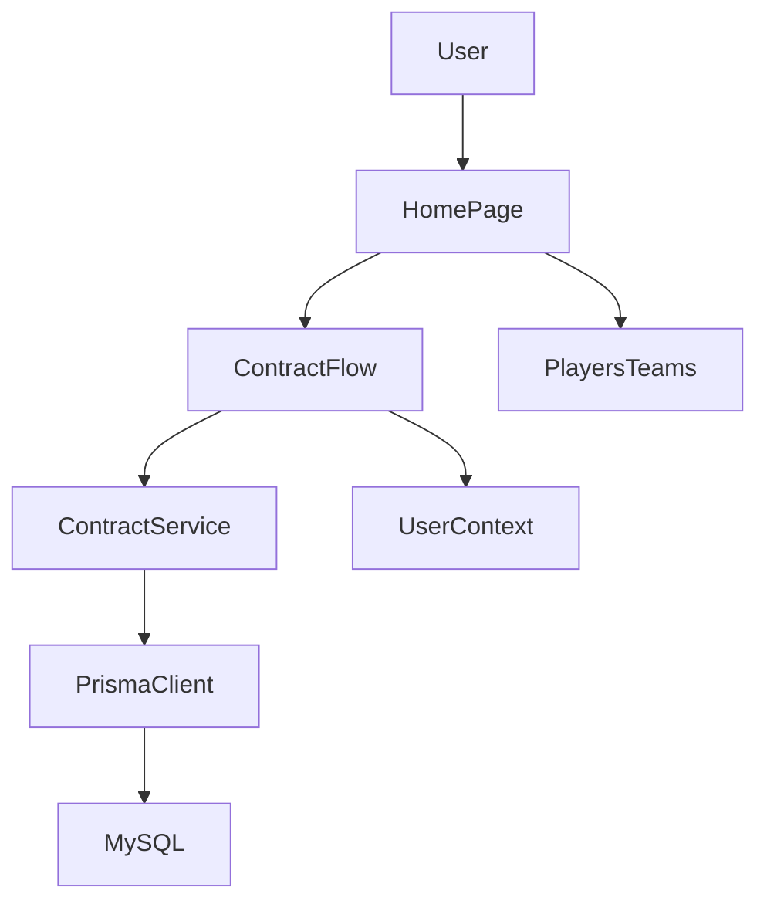
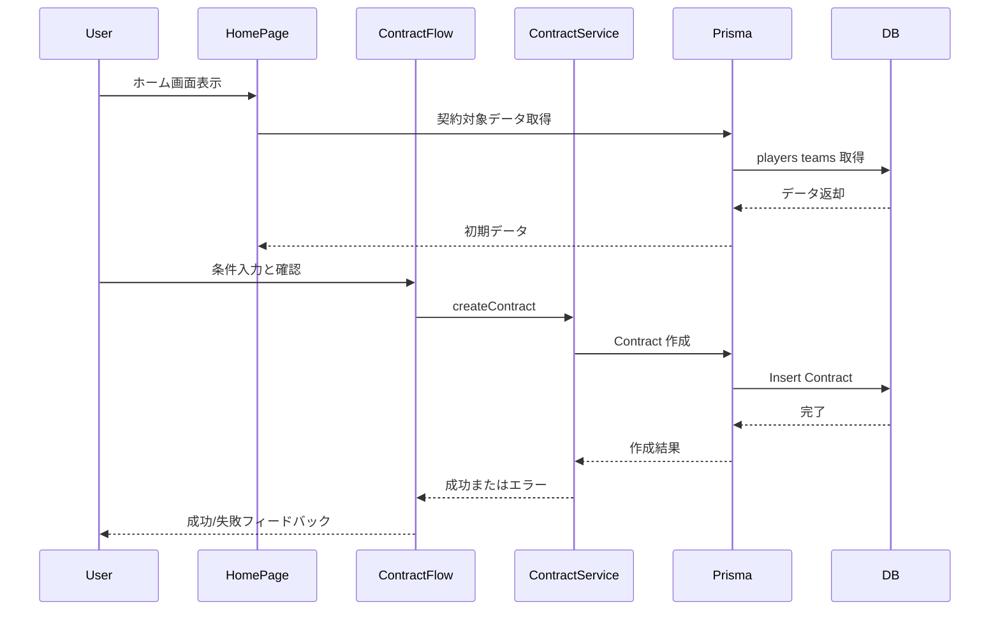

# Design Document

## Overview
本機能は、FootballContractSim のホーム画面に契約開始から確定までの一連のフローを統合し、ユーザーが「契約できる」体験を起点から提供する。ホーム画面に契約対象の可視化、条件入力、確認、確定の導線を集約し、既存の選手/チーム管理機能と連携して契約データを作成する。

主な利用者は契約シミュレーションを試したいプレイヤーであり、ホーム画面で契約条件を入力し、作成結果を確認する。現行の Next.js App Router 構成に沿って、Server Component と Client Component を分離し、Server Actions で契約作成を行う。

### Goals
- ホーム画面から契約手続きの開始、確認、確定を完結させる
- 選手/クラブの選択と契約条件入力を一貫した UI で提供する
- 契約作成結果とエラーを明確にフィードバックする

### Non-Goals
- 契約交渉ロジックや市場価値計算の高度化
- 認証・権限管理の導入
- 契約履歴の一覧・検索 UI の提供

## Architecture

### Existing Architecture Analysis
- App Router でページごとに Server Component を採用し、Prisma を直接利用している
- フォームの作成/更新/削除は Server Actions を使用するパターンがある
- UI は Tailwind CSS のユーティリティを使った構成

### Architecture Pattern & Boundary Map
**Architecture Integration**:
- Selected pattern: Feature-based App Router + Server Actions
- Domain/feature boundaries: `contract` 機能を `src/app/contracts` 配下に集約し、ホーム画面から参照
- Existing patterns preserved: Server Component で初期データ取得、Client Component でフォーム管理
- New components rationale: 契約入力フローと永続化の責務を分離
- Steering compliance: App Router 構成・Prisma 直接利用・ドメイン分離方針を維持



## Technology Stack

| Layer | Choice / Version | Role in Feature | Notes |
|-------|------------------|-----------------|-------|
| Frontend / UI | Next.js 15, React 19, Tailwind CSS v4 | ホーム画面と契約フロー UI | 既存スタックを踏襲 |
| Backend / Services | Next.js Server Actions | 契約作成・検証 | 新規 API 追加なし |
| Data / Storage | Prisma, MySQL | 契約データ永続化 | `Contract` モデル追加 |
| Infrastructure / Runtime | Node.js | 実行環境 | 既存構成を維持 |

## System Flows



## Requirements Traceability

| Requirement | Summary | Components | Interfaces | Flows |
|-------------|---------|------------|------------|-------|
| 1.1 | CTA と概要表示 | HomePage | State | - |
| 1.2 | 契約可能状態の明示 | HomePage | State | - |
| 1.3 | 空状態の説明 | HomePage | State | - |
| 1.4 | 契約入力開始 | ContractFlow | State | - |
| 2.1 | 選手/クラブ一覧 | HomePage, ContractFlow | State | - |
| 2.2 | 選択後の識別情報 | ContractFlow | State | - |
| 2.3 | 未入力時の確定不可 | ContractFlow | State | - |
| 2.4 | 無効選択のエラー | ContractFlow | State | - |
| 3.1 | 条件入力 | ContractFlow | State | - |
| 3.2 | 入力検証 | ContractFlow, ContractService | Service, State | - |
| 3.3 | エラー時の確定不可 | ContractFlow | State | - |
| 3.4 | 条件要約表示 | ContractFlow | State | - |
| 4.1 | 最終確認表示 | ContractFlow | State | - |
| 4.2 | 契約作成 | ContractService | Service | ContractCreation |
| 4.3 | 失敗時の再試行 | ContractFlow | State | - |
| 4.4 | 参照情報提示 | ContractFlow | State | - |
| 5.1 | 処理中表示 | ContractFlow | State | ContractCreation |
| 5.2 | 即時フィードバック | ContractFlow | State | - |
| 5.3 | 識別可能ラベル | HomePage, ContractFlow | State | - |
| 5.4 | レスポンシブ維持 | HomePage, ContractFlow | State | - |
| 6.1 | 現在ユーザー識別 | HomePage, UserContext | State | - |
| 6.2 | 未識別時の制御と提示 | ContractFlow, UserContext | State | - |
| 6.3 | 契約のユーザー紐付け | ContractService, UserContext | Service, State | ContractCreation |
| 6.4 | ユーザーごとの契約参照 | ContractService | Service | - |
| 6.5 | 不正参照の拒否 | ContractService | Service | - |

## Components and Interfaces

| Component | Domain/Layer | Intent | Req Coverage | Key Dependencies (P0/P1) | Contracts |
|-----------|--------------|--------|--------------|--------------------------|-----------|
| HomePage | UI Server | ホーム画面で契約導線と初期データを提供 | 1.1, 1.2, 1.3, 2.1, 5.3, 5.4 | PrismaClient (P0) | State |
| ContractFlow | UI Client | 契約対象選択、条件入力、確認、確定 | 1.4, 2.2-2.4, 3.1-3.4, 4.1, 4.3-4.4, 5.1-5.4 | ContractService (P0) | State, Service |
| UserContext | UI/Server Shared | 現在ユーザーの識別と切替状態の提供 | 6.1, 6.2, 6.3 | PrismaClient (P1) | State, Service |
| ContractService | Server Action | 契約作成と検証 | 3.2, 4.2 | PrismaClient (P0) | Service |

### UI Layer

#### HomePage
| Field | Detail |
|-------|--------|
| Intent | ホーム画面の初期データ取得と契約導線の提示 |
| Requirements | 1.1, 1.2, 1.3, 2.1, 5.3, 5.4 |

**Responsibilities & Constraints**
- 契約対象となる選手/クラブの初期データ取得
- 空状態や契約可能状態の表示

**Dependencies**
- Inbound: App Router — ルートページ (P0)
- Outbound: PrismaClient — 選手・クラブ取得 (P0)

**Contracts**: State [x]

**Implementation Notes**
- Integration: 既存の `page.tsx` をホーム画面として置き換える
- Validation: データ取得失敗時は空状態表示
- Risks: 初期データ量が多い場合の表示遅延

#### ContractFlow
| Field | Detail |
|-------|--------|
| Intent | 契約対象選択と条件入力から確定までの UI フロー管理 |
| Requirements | 1.4, 2.2-2.4, 3.1-3.4, 4.1, 4.3-4.4, 5.1-5.4 |

**Responsibilities & Constraints**
- 選手/クラブの選択と条件入力の状態管理
- 入力検証結果の即時提示
- 契約確定時のサーバー処理と結果表示

**Dependencies**
- Inbound: HomePage — 初期選手/クラブデータ (P0)
- Outbound: ContractService — 契約作成 (P0)

**Contracts**: Service [x] / State [x]

##### State Management
- State model: `ContractDraftState` (stage, selection, terms, errors, submission)
- Persistence & consistency: クライアントローカルのみ
- Concurrency strategy: 送信中は `submitting` 状態で重複送信を抑止

##### Service Interface
```typescript
type UserId = number;

type ContractOption = {
  id: number;
  name: string;
  meta?: string;
};

type ContractDraftInput = {
  playerId: number | null;
  teamId: number | null;
  startDate: string;
  endDate: string;
  wage: number | null;
};

type ContractCreateInput = {
  playerId: number;
  teamId: number;
  startDate: string;
  endDate: string;
  wage: number;
};

type ContractCreateError =
  | { type: 'UserContextMissing'; message: string }
  | { type: 'Validation'; message: string; fields: string[] }
  | { type: 'NotFound'; message: string }
  | { type: 'Conflict'; message: string }
  | { type: 'System'; message: string };

type ContractCreateResult =
  | { ok: true; contractId: number }
  | { ok: false; error: ContractCreateError };

interface ContractService {
  createContract(input: ContractCreateInput): Promise<ContractCreateResult>;
}

type UserContextError =
  | { type: 'NotSelected'; message: string }
  | { type: 'System'; message: string };

type UserContextResult =
  | { ok: true; userId: UserId; displayName: string }
  | { ok: false; error: UserContextError };

interface UserContextService {
  getCurrentUser(): Promise<UserContextResult>;
  setCurrentUser(input: { userId: UserId }): Promise<{ ok: true } | { ok: false; error: UserContextError }>;
}
```
- Preconditions: 現在ユーザーが識別済みであり、`playerId` と `teamId` が存在し、`startDate < endDate`、`wage > 0`
- Postconditions: 成功時は新規 `Contract` が現在ユーザーに関連付いて永続化され ID を返す
- Invariants: ユーザー境界を跨ぐ参照・作成は行われない

**Implementation Notes**
- Integration: Server Actions の戻り値を UI で分岐処理
- Validation: 入力不足はクライアントで即時表示し、最終検証はサーバーで再確認
- Risks: 画面遷移無しで完結するため、成功後の状態初期化が必要

### Server Layer

#### ContractService
| Field | Detail |
|-------|--------|
| Intent | 契約作成の検証と永続化を担う |
| Requirements | 3.2, 4.2 |

**Responsibilities & Constraints**
- 契約入力の妥当性検証
- `Contract` データの作成
- 現在ユーザーの識別結果に基づく分離（作成/参照のスコープ制限）
- エラー分類の一貫性保持

**Dependencies**
- Inbound: ContractFlow — 契約作成 요청 (P0)
- Outbound: PrismaClient — Contract/Player/Team 参照と作成 (P0)

**Contracts**: Service [x]

##### Service Interface
```typescript
interface ContractService {
  createContract(input: ContractCreateInput): Promise<ContractCreateResult>;
}
```
- Preconditions: `playerId` / `teamId` が存在し、期間が妥当である
- Postconditions: 契約が保存され参照 ID を返す
- Invariants: 失敗時は契約が作成されない

**Implementation Notes**
- Integration: Prisma を直接利用し `Contract` を作成
- Validation: 現在ユーザーの識別、入力値・存在チェック・期間整合
- Risks: トランザクション境界の不足は将来の複数更新で要検討

## Data Models

### Domain Model
- Aggregate: Contract
- Entities: Contract, Player, Team
- Business rules & invariants:
  - 契約期間は開始日 < 終了日
  - 報酬は正の数値

### Logical Data Model
- Contract は User と Player と Team に必須で紐づく
- `Contract` は単一の `Player` と単一の `Team` を参照する
- 主キーは `id`、`userId` と `playerId` と `teamId` は外部キー

### Physical Data Model
- Prisma に `Contract` モデルを追加
- 主なフィールド例: `id`, `userId`, `playerId`, `teamId`, `startDate`, `endDate`, `wage`, `createdAt`, `updatedAt`
- インデックス: `userId`, `playerId`, `teamId`, `startDate` を検討

### Data Contracts & Integration
- API Data Transfer: Server Actions で `ContractCreateInput` を利用
- Validation rules: 必須フィールドの欠落と範囲外値は `Validation` エラー

## Error Handling

### Error Strategy
- 入力エラーはフィールド単位のエラーメッセージを返す
- サーバー障害は汎用エラーとして表示し再試行を促す

### Error Categories and Responses
- User Errors (4xx 相当): 不正入力 → フィールド表示
- System Errors (5xx 相当): DB 失敗 → 再試行メッセージ
- Business Logic Errors (422 相当): 期間不整合 → 条件の説明

### Monitoring
- サーバーエラーは `console.error` で記録し、将来的な監視基盤に接続可能な形式を維持

## Testing Strategy

- Unit Tests: `ContractService` の入力検証、期間整合、エラー分類
- Integration Tests: 契約作成フロー、選手/チーム存在確認、DB 永続化
- E2E/UI Tests: ホーム画面の契約開始、入力エラー表示、成功後の確認

## Optional Sections

### Security Considerations
- 認証・権限は現時点の非スコープ。Server Actions で入力バリデーションのみ担保

### Migration Strategy
- `Contract` 追加のマイグレーションを適用
- シードデータは必要に応じて後続タスクで追加
