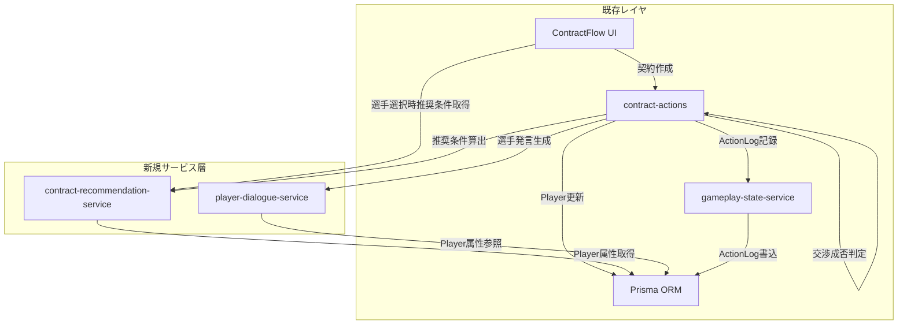
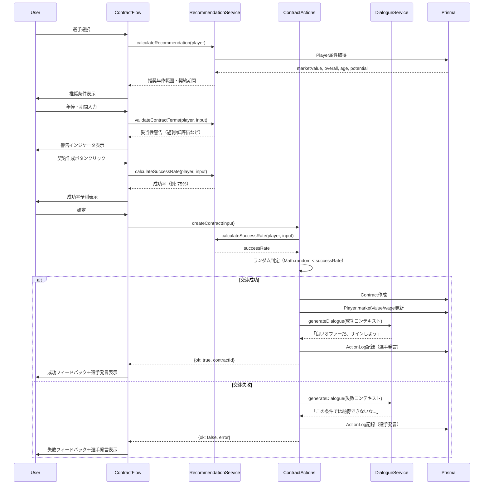
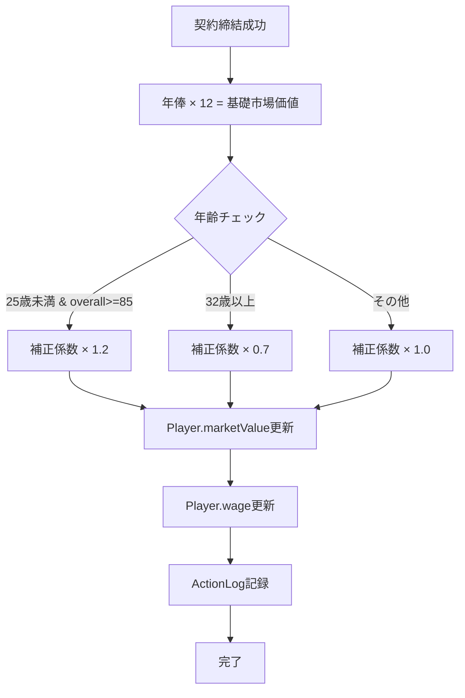

# Design Document

## Overview

本機能は、FootballContractSimの契約シミュレーションにリアリティを付与します。選手の市場価値・能力値・年齢・ポテンシャルに基づく動的な契約条件生成、確率的な交渉成否判定、選手視点の発言システムを導入し、プレイヤーがより戦略的で没入感のある契約交渉を体験できるようにします。将来的なAI統合を見据えた拡張可能な設計により、選手の発言をLLMで動的生成する道を開きます。

**Purpose**: 単純な契約CRUD操作から、現実のフットボール業界に近い交渉体験へと進化させることで、ゲームの戦略性と没入感を向上させます。

**Users**: FootballContractSimのプレイヤー（契約交渉フローを利用するユーザー）が、選手とクラブの契約条件を入力する際に、リアルタイムで推奨条件・妥当性警告・交渉成功率予測を受け取り、選手の発言を通じて交渉結果を体験します。

**Impact**: 既存の契約作成フロー（ContractFlow.tsx, contract-actions.ts）を拡張し、新規サービス層（contract-recommendation-service.ts, player-dialogue-service.ts）を追加します。ActionLog・UIコンポーネントは選手発言表示に対応し、Playerモデルの市場価値・年俸フィールドは契約締結時に動的更新されます。

### Goals
- 選手属性（marketValue, overall, potential, age）に基づく推奨年俸・契約期間の自動算出
- リアルタイム契約条件妥当性検証と警告UI（過剰評価/低評価/ミスマッチ検出）
- 確率的交渉成否判定による戦略的意思決定の導入
- 選手視点の間接的ヒント発言システム（ルールベース初期実装+AI拡張インターフェース）
- 契約締結時の市場価値・年俸の動的更新による経済モデルのリアリティ向上

### Non-Goals
- AI統合の実装（Phase 2に延期、本設計ではインターフェース定義のみ）
- 複雑なアニメーション（基本的なフィードバック表示のみ、高度なアニメーションはPhase 2）
- クラブ側の交渉ロジック（本設計は選手視点のみ）
- 複数オファー同時比較機能（将来拡張）
- 専用の試行追跡テーブル（Phase 1はActionLog解析で対応）

## Architecture

### Existing Architecture Analysis

**現在のアーキテクチャ**:
- Next.js App Router + Server Actions（`'use server'`）でフロントエンドとバックエンドを統合
- Prismaによるデータアクセス層（Player, Contract, ActionLogなどのモデル）
- 型安全な結果型パターン: `{ ok: true, data: T } | { ok: false, error: E }`
- UIコンポーネント（`'use client'`）は状態管理とServer Actionsを呼び出し

**既存のドメイン境界**:
- `src/app/contracts/`: 契約関連のUIコンポーネント・サーバアクション・状態管理
- `src/domain/`: ドメイン知識（positions.tsなど）
- `src/lib/`: インフラ共通処理（Prismaクライアント）

**統合ポイント**:
- `contract-actions.ts`: 契約CRUD操作のサーバアクション
- `gameplay-state-service.ts`: ActionLog記録・ダッシュボード状態管理
- `ContractFlow.tsx`: 契約作成UI（選手・クラブ選択、条件入力、確認）
- ActionLog: `message`, `hint`, `deltaHighlights`フィールドで汎用的なイベント記録

**技術的制約**:
- ActionType enumは既存の`ContractCreated`/`ContractFailed`を継続利用（新規enum追加は最小限）
- Player.marketValue, Player.wageの更新はトランザクション内で実施
- UI拡張は既存のTailwind CSSパターンに従う

### Architecture Pattern & Boundary Map

**選択パターン**: Hybrid Approach (Service Layer Pattern + Existing Component Extension)

**Rationale**:
- 新規サービス層（contract-recommendation-service, player-dialogue-service）で責務を分離し、AI統合時の影響範囲を限定
- 既存コンポーネント（contract-actions, ContractFlow）は最小限の拡張で新サービスを呼び出し
- ActionLog既存構造を活用し、破壊的変更を回避

**ドメイン/機能境界**:
```
契約フロー層 (ContractFlow.tsx)
 ↓ 呼び出し
契約オーケストレーション層 (contract-actions.ts)
 ↓ 利用
新規サービス層
 ├── contract-recommendation-service.ts (推奨条件算出・妥当性検証)
 ├── player-dialogue-service.ts (選手発言生成)
 └── simulation-config.ts (シミュレーション設定管理)
 ↓ 依存
データ層 (Prisma: Player, Contract, ActionLog)
```

**既存パターンの保持**:
- 型安全な結果型パターン（`Result<T, E>`）をすべての新規サービスで採用
- Server Actions（`'use server'`）によるクライアント・サーバ境界
- `recordAction`によるActionLog統合パターン

**新規コンポーネントのRationale**:
- **contract-recommendation-service**: 契約条件算出ロジックを独立化し、単体テスト容易化・将来的な複雑化対応
- **player-dialogue-service**: 発言生成を分離し、AI統合インターフェースを明確化
- **simulation-config**: シミュレーションロジックの定数・しきい値を集中管理し、ビジネスルール変更を容易化

**Steering準拠**:
- App Router標準に沿った`app/`ディレクトリ構成
- ドメイン知識の`src/domain/`分離原則（新規サービスは`src/app/contracts/`に配置）
- TypeScript型安全性・Prisma ORMの活用



### Technology Stack

| Layer | Choice / Version | Role in Feature | Notes |
|-------|------------------|-----------------|-------|
| Frontend | React 19 + Next.js 15 App Router | ContractFlow UI拡張（推奨条件表示・警告UI・成功率予測） | 既存Tailwind CSSパターン踏襲 |
| Backend | TypeScript + Next.js Server Actions | 新規サービス層実装、contract-actions拡張 | `'use server'`ディレクティブ継続 |
| Data | Prisma 5.x + MySQL | Player.marketValue/wage更新、ActionLog記録 | トランザクション管理は`prisma.$transaction`利用 |
| Type System | TypeScript 5.x | 厳密な型定義（`any`禁止、Result型パターン） | 新規型は全て明示的に定義 |

**技術選定の根拠**:
- 既存スタック（Next.js App Router + Prisma）を最大限活用し、学習コスト・統合リスクを最小化
- TypeScript型安全性により、契約条件計算・交渉判定ロジックのバグを設計時に検出
- AI統合はPhase 2で検討（OpenAI API, Anthropic Claude, Vercel AI SDKなど、詳細は`research.md`参照）

## System Flows

### 契約作成フロー（交渉判定統合版）



**フロー判断ポイント**:
- 推奨条件取得: 選手選択直後に実行、UIでリアルタイム表示
- 妥当性検証: 年俸・期間入力時にリアルタイム実行、警告即座表示
- 成功率算出: 契約作成前に表示、確定時に再実行して判定
- ランダム判定: サーバ側で実行（クライアント側では予測不可能性を確保）

### Player市場価値更新フロー



**市場価値更新ルール**:
- 基礎計算: 年俸 × 12
- 若手スター補正: 25歳未満 かつ overall >= 85 → × 1.2
- ベテラン補正: 32歳以上 → × 0.7
- その他: × 1.0（補正なし）

## Requirements Traceability

| Requirement | Summary | Components | Interfaces | Flows |
|-------------|---------|------------|------------|-------|
| 1.1, 1.2, 1.3, 1.4, 1.5 | 市場価値ベース契約条件生成 | RecommendationService, ContractFlow | calculateRecommendation | 契約作成フロー（推奨条件取得） |
| 2.1, 2.2, 2.3, 2.4, 2.5 | 契約条件妥当性検証 | RecommendationService, ContractFlow | validateContractTerms | 契約作成フロー（妥当性検証） |
| 3.1, 3.2, 3.3, 3.4, 3.5, 3.6, 3.7 | 契約交渉成否判定 | ContractActions, RecommendationService, DialogueService | calculateSuccessRate, generateDialogue | 契約作成フロー（交渉判定） |
| 4.1, 4.2, 4.3, 4.4, 4.5 | 契約提示履歴と学習ヒント | ContractActions, ActionHistory, DialogueService | generateDialogue, recordAction | 契約作成フロー（失敗時発言記録） |
| 5.1, 5.2, 5.3, 5.4, 5.5 | 市場価値と年俸の動的更新 | ContractActions, Prisma | updatePlayerMarketValue | Player市場価値更新フロー |
| 6.1, 6.2, 6.3, 6.4, 6.5, 6.6 | 契約UI拡張とフィードバック | ContractFlow, ActionFeedback | UI Props拡張 | 契約作成フロー（UI表示） |
| 7.1, 7.2, 7.3, 7.4, 7.5, 7.6, 7.7, 7.8 | AI拡張可能な選手発言システム | DialogueService | generateDialogue, AIDialogueProvider（Phase 2） | 契約作成フロー（発言生成） |

## Components and Interfaces

### Summary

| Component | Domain/Layer | Intent | Req Coverage | Key Dependencies | Contracts |
|-----------|--------------|--------|--------------|------------------|-----------|
| SimulationConfig | Backend/Config | シミュレーション設定管理 | 1.1-1.4, 2.1-2.4, 3.1-3.4, 5.1-5.3 | なし | Service |
| RecommendationService | Backend/Service | 推奨条件算出・妥当性検証 | 1.1-1.5, 2.1-2.5, 3.1-3.5 | SimulationConfig (P0), Prisma Player (P0) | Service |
| DialogueService | Backend/Service | 選手発言生成（ルールベース+AI IF） | 3.6-3.7, 4.1-4.5, 7.1-7.8 | Prisma Player (P1) | Service |
| ContractActions拡張 | Backend/Action | 交渉判定統合・市場価値更新 | 3.1-3.7, 5.1-5.5 | RecommendationService (P0), DialogueService (P0), Prisma (P0) | Service |
| ContractFlow UI | Frontend/UI | 推奨条件・警告・成功率表示 | 1.5, 2.5, 6.1-6.6 | RecommendationService (P0), ContractActions (P0) | State |
| ActionFeedback UI | Frontend/UI | 選手発言フィードバック表示 | 6.4-6.5 | ActionResultSummary (P0) | State |
| ActionHistory UI | Frontend/UI | 発言履歴表示 | 4.2 | ActionResultSummary (P0) | State |

### Backend/Config

#### simulation-config

| Field | Detail |
|-------|--------|
| Intent | シミュレーションロジックの定数・しきい値・計算式を集中管理し、ビジネスルール変更を容易化 |
| Requirements | 1.1, 1.2, 1.3, 1.4, 2.1, 2.2, 2.3, 2.4, 3.1, 3.2, 3.3, 3.4, 5.1, 5.2, 5.3 |

**Responsibilities & Constraints**
- 推奨年俸計算のパラメータ（市場価値比率の範囲：5-15%）
- 妥当性検証のしきい値（過剰評価：20%、低評価：3%、能力値と年俸のミスマッチ基準）
- 交渉成功率の計算式パラメータ（期待年俸比率と成功率のマッピング）
- 市場価値更新の補正係数（若手スター：1.2、ベテラン：0.7、基礎倍率：12）
- 設定値はimmutableオブジェクトとして公開、変更時は新規インスタンス生成
- 将来的に環境変数・設定ファイル・データベースから読み込み可能な設計

**Dependencies**
- Inbound: RecommendationService (P0)
- Outbound: なし（純粋な設定提供層）

**Contracts**: [x] Service [ ] API [ ] Event [ ] Batch [ ] State

##### Service Interface

```typescript
// シミュレーション設定型
type SimulationConfig = {
  recommendation: {
    wageRatio: { min: number; max: number }; // 市場価値の何%を年俸とするか（例: 0.05 - 0.15）
    contractYears: {
      youngProspect: { min: number; max: number }; // 25歳未満 & ポテンシャル高い選手
      veteran: { min: number; max: number }; // 30歳以上
      standard: { min: number; max: number }; // その他
    };
    youngProspectThreshold: { maxAge: number; potentialGap: number }; // 例: 25歳未満 & potential - overall >= 15
    veteranThreshold: { minAge: number }; // 例: 30歳以上
  };
  validation: {
    overvaluationThreshold: number; // 市場価値の何%超過で警告（例: 0.20）
    undervaluationThreshold: number; // 市場価値の何%未満で警告（例: 0.03）
    mismatchThreshold: { maxOverall: number; maxWage: number }; // 例: overall < 70 & wage > 20000
    longTermRiskThreshold: { maxAge: number; maxYears: number }; // 例: 18歳未満 & 3年超
  };
  negotiation: {
    expectedWageRatio: number; // 選手の期待年俸（市場価値の何%）（例: 0.08）
    successRateMap: {
      low: { threshold: number; rate: { min: number; max: number } }; // 期待年俸の90%未満 → 30%以下
      medium: { threshold: { min: number; max: number }; rate: { min: number; max: number } }; // 90-110% → 70-80%
      high: { threshold: number; rate: { min: number; max: number } }; // 110%以上 → 95%以上
    };
  };
  marketValue: {
    baseMultiplier: number; // 年俸 × 何倍 = 市場価値（例: 12）
    ageCorrection: {
      youngStar: { maxAge: number; minOverall: number; multiplier: number }; // 例: 25歳未満 & overall>=85 → × 1.2
      veteran: { minAge: number; multiplier: number }; // 例: 32歳以上 → × 0.7
    };
  };
};

// デフォルト設定（Phase 1）
const DEFAULT_SIMULATION_CONFIG: SimulationConfig = {
  recommendation: {
    wageRatio: { min: 0.05, max: 0.15 },
    contractYears: {
      youngProspect: { min: 4, max: 5 },
      veteran: { min: 1, max: 2 },
      standard: { min: 2, max: 4 },
    },
    youngProspectThreshold: { maxAge: 25, potentialGap: 15 },
    veteranThreshold: { minAge: 30 },
  },
  validation: {
    overvaluationThreshold: 0.20,
    undervaluationThreshold: 0.03,
    mismatchThreshold: { maxOverall: 70, maxWage: 20000 },
    longTermRiskThreshold: { maxAge: 18, maxYears: 3 },
  },
  negotiation: {
    expectedWageRatio: 0.08,
    successRateMap: {
      low: { threshold: 0.90, rate: { min: 0.10, max: 0.30 } },
      medium: { threshold: { min: 0.90, max: 1.10 }, rate: { min: 0.70, max: 0.80 } },
      high: { threshold: 1.10, rate: { min: 0.95, max: 1.00 } },
    },
  },
  marketValue: {
    baseMultiplier: 12,
    ageCorrection: {
      youngStar: { maxAge: 25, minOverall: 85, multiplier: 1.2 },
      veteran: { minAge: 32, multiplier: 0.7 },
    },
  },
};

interface SimulationConfigService {
  getConfig(): SimulationConfig;
  // Phase 2: 設定の動的更新
  // updateConfig(partial: Partial<SimulationConfig>): void;
  // loadFromEnvironment(): SimulationConfig;
  // loadFromDatabase(): Promise<SimulationConfig>;
}
```

**Preconditions**:
- なし（設定提供のみ）

**Postconditions**:
- 常に有効なSimulationConfigオブジェクトを返却
- 設定値は数値の整合性が保証されている（min <= max、正の値など）

**Invariants**:
- デフォルト設定は常に利用可能
- 設定値の変更は新規オブジェクト生成（immutable）
- すべての比率は0.0-1.0範囲、倍率は正の数値

**Implementation Notes**
- **Integration**: RecommendationServiceのコンストラクタまたは関数引数で設定を注入（Dependency Injection）
- **Validation**: 設定オブジェクト生成時に値の範囲・整合性を検証、不正値はエラーをスロー
- **Phase 2拡張**: 環境変数（`SIMULATION_WAGE_RATIO_MIN`など）、JSONファイル、データベーステーブルから読み込み
- **Risks**: 設定値の不適切な変更により、交渉成功率が極端に高い/低い状態になる可能性（設定変更時のA/Bテスト推奨）

---

### Backend/Service

#### contract-recommendation-service

| Field | Detail |
|-------|--------|
| Intent | 選手属性から推奨契約条件を算出し、入力条件の妥当性を検証する |
| Requirements | 1.1, 1.2, 1.3, 1.4, 1.5, 2.1, 2.2, 2.3, 2.4, 2.5, 3.1, 3.2, 3.3, 3.4, 3.5 |

**Responsibilities & Constraints**
- 選手の市場価値・能力値・年齢・ポテンシャルから推奨年俸範囲と契約期間を算出
- ユーザー入力年俸・期間の妥当性を判定し、警告タイプ（過剰評価/低評価/ミスマッチ/長期契約リスク）を返却
- 提示年俸と選手期待年俸（市場価値の8%）の差分から交渉成功率を算出
- トランザクション不要（読み取り専用）、Player属性を変更しない

**Dependencies**
- Inbound: contract-actions, ContractFlow (P0)
- Outbound: SimulationConfig (P0), Prisma Player model (P0)

**Contracts**: [x] Service [ ] API [ ] Event [ ] Batch [ ] State

##### Service Interface

```typescript
// 推奨条件
type RecommendedTerms = {
  wageRange: { min: number; max: number }; // 推奨年俸範囲（週給）
  contractYears: { min: number; max: number }; // 推奨契約年数
  rationale: string; // 算出根拠（例: 「25歳未満でポテンシャル高」）
};

// 妥当性警告
type ValidationWarning = {
  type: 'Overvaluation' | 'Undervaluation' | 'Mismatch' | 'LongTermRisk';
  message: string;
  severity: 'info' | 'warning' | 'error';
};

type ValidationResult = {
  warnings: ValidationWarning[];
  isValid: boolean; // 警告があってもtrueの場合あり（情報提供のみ）
};

// 成功率算出結果
type SuccessRateResult = {
  rate: number; // 0.0 - 1.0
  expectedWage: number; // 選手の期待年俸（市場価値の8%）
  wageDifference: number; // 提示年俸 - 期待年俸
};

interface ContractRecommendationService {
  calculateRecommendation(player: Player): RecommendedTerms;
  
  validateContractTerms(
    player: Player,
    input: { wage: number; startDate: Date; endDate: Date }
  ): ValidationResult;
  
  calculateSuccessRate(
    player: Player,
    input: { wage: number; startDate: Date; endDate: Date }
  ): SuccessRateResult;
}
```

**Preconditions**:
- Player オブジェクトは有効なフィールド（marketValue, overall, potential, age）を持つ
- 入力年俸は正の数値、契約期間は開始日 < 終了日

**Postconditions**:
- 推奨条件は市場価値の5-15%範囲、契約期間は年齢・ポテンシャルに応じて1-5年
- 妥当性警告は空配列または1つ以上の警告オブジェクト
- 成功率は0.0-1.0の範囲

**Invariants**:
- 推奨年俸範囲のmin <= max
- 推奨契約年数のmin <= max
- 成功率は期待年俸との差分に応じて単調増加（提示額が高いほど成功率上昇）

**Implementation Notes**
- **Integration**: contract-actions.tsの`createContract`関数から`calculateSuccessRate`を呼び出し、交渉判定に利用。SimulationConfigはシングルトンまたはファクトリ関数で取得
- **Validation**: SimulationConfig.validation.overvaluationThresholdを超過時は`Overvaluation`警告、undervaluationThreshold未満時は`Undervaluation`警告を生成
- **Algorithm Flexibility**: 計算ロジックはSimulationConfigのパラメータに依存し、設定変更のみでビジネスルール調整が可能。Phase 2で複数の計算戦略（Strategy Pattern）を導入可能
- **Risks**: marketValueがnullの場合、デフォルト値（overall × 10000など）を仮定するか、警告を返す

---

#### player-dialogue-service

| Field | Detail |
|-------|--------|
| Intent | 交渉コンテキストから選手の発言を生成する（ルールベース初期実装+AI拡張インターフェース） |
| Requirements | 3.6, 3.7, 4.1, 4.2, 4.5, 7.1, 7.2, 7.3, 7.4, 7.5, 7.6, 7.7, 7.8 |

**Responsibilities & Constraints**
- 交渉結果（成功/失敗）、年俸差分、選手属性（年齢・能力値・ポテンシャル）から発言を生成
- Phase 1: ルールベーステンプレートマッチング（選手属性による発言トーン調整）
- Phase 2: AI統合インターフェース（外部LLM API呼び出し）のプレースホルダー提供
- トランザクション不要、データ変更なし（読み取り専用）

**Dependencies**
- Inbound: contract-actions (P0)
- Outbound: Prisma Player model (P1) - 選手属性参照
- External (Phase 2): OpenAI API / Anthropic Claude / Vercel AI SDK (P2)

**Contracts**: [x] Service [ ] API [ ] Event [ ] Batch [ ] State

##### Service Interface

```typescript
// 交渉コンテキスト
type NegotiationContext = {
  outcome: 'success' | 'failure';
  player: {
    id: number;
    name: string;
    age: number;
    overall: number;
    potential: number;
  };
  wageDifference: number; // 提示年俸 - 期待年俸
  attemptCount: number; // 同一選手への試行回数（ActionLog解析結果）
};

// 発言生成結果
type DialogueResult = {
  message: string; // 選手の発言
  tone: 'positive' | 'neutral' | 'negative'; // 発言トーン
};

interface PlayerDialogueService {
  generateDialogue(context: NegotiationContext): DialogueResult;
}

// Phase 2拡張: AI統合インターフェース
interface AIDialogueProvider {
  generateDialogueWithAI(context: NegotiationContext): Promise<DialogueResult>;
}
```

**Preconditions**:
- NegotiationContext.outcomeは'success'または'failure'
- NegotiationContext.playerは有効なPlayer属性を持つ
- attemptCountは0以上の整数

**Postconditions**:
- messageは選手視点の間接的ヒント（直接的な「年俸を上げてください」ではなく「もう少し評価してくれると嬉しい」）
- toneは発言のトーンを表現（UI表示で色・アイコン変更に利用可能）

**Invariants**:
- 成功時は常にpositive/neutralトーン
- 失敗時は常にnegative/neutralトーン
- 同一コンテキストで複数回呼び出しても、同じカテゴリの発言が返る（決定論的、Phase 1）

**Implementation Notes**
- **Integration**: contract-actions.tsの交渉成功/失敗分岐で`generateDialogue`を呼び出し、結果を`recordAction`に渡す
- **Validation**: ルールベーステンプレートは交渉状況タイプ（成功/失敗/年俸不足/期間不適切）ごとに3-5パターン用意
- **AI統合パス（Phase 2）**: 環境変数`ENABLE_AI_DIALOGUE=true`時に`AIDialogueProvider`を利用、フォールバックはルールベース
- **Risks**: AI統合時のレイテンシ（200-500ms想定）、コスト管理（月間API呼び出し上限設定）

---

### Backend/Action

#### contract-actions拡張

| Field | Detail |
|-------|--------|
| Intent | 既存の契約作成処理に交渉判定・市場価値更新ロジックを統合 |
| Requirements | 3.1, 3.2, 3.3, 3.4, 3.5, 3.6, 3.7, 5.1, 5.2, 5.3, 5.4, 5.5 |

**Responsibilities & Constraints**
- 既存`createContract`関数を拡張し、交渉成否判定を追加
- 交渉成功時: Contract作成 + Player.marketValue/wage更新 + 成功発言記録
- 交渉失敗時: Contract作成せず + 失敗発言記録
- トランザクション境界: Contract作成とPlayer更新は同一トランザクション内で実行

**Dependencies**
- Inbound: ContractFlow UI (P0)
- Outbound: RecommendationService (P0), DialogueService (P0), Prisma (P0), gameplay-state-service.recordAction (P0)

**Contracts**: [x] Service [ ] API [ ] Event [ ] Batch [ ] State

##### Service Interface

```typescript
// 既存型を拡張（型定義変更なし、内部ロジック拡張）
type ContractCreateInput = {
  playerId: number;
  teamId: number;
  startDate: string;
  endDate: string;
  wage: number;
};

type ContractCreateResult =
  | { ok: true; contractId: number; playerDialogue: string } // 選手発言追加
  | { ok: false; error: ContractCreateError; playerDialogue?: string }; // 失敗時も発言追加
```

**Preconditions**:
- 既存の`createContract`の前提条件を継承
- RecommendationServiceとDialogueServiceが利用可能

**Postconditions**:
- 交渉成功時: Contract作成、Player.marketValue/wageが更新、ActionLog記録
- 交渉失敗時: Contractは作成されず、ActionLog記録のみ

**Invariants**:
- 交渉判定はサーバ側でのみ実行（クライアント側でランダムシード操作不可）
- Player更新は成功時のみ実行（失敗時はロールバック不要）

**Implementation Notes**
- **Integration**: 既存の`createContract`関数内に以下を追加:
  1. `calculateSuccessRate`呼び出し → 成功率取得
  2. `Math.random() < successRate`で判定
  3. 成功時: 既存のContract作成 → Player更新 → `generateDialogue(成功)` → recordAction
  4. 失敗時: `generateDialogue(失敗)` → recordAction → 早期リターン
- **Validation**: 交渉判定前に既存のバリデーションを実行（選手・クラブ存在確認、入力妥当性）
- **Risks**: トランザクション失敗時のエラーハンドリング（Prisma.$transaction利用、ロールバック保証）

---

### Frontend/UI

#### ContractFlow UI拡張

| Field | Detail |
|-------|--------|
| Intent | 推奨条件・妥当性警告・交渉成功率をリアルタイム表示 |
| Requirements | 1.5, 2.5, 6.1, 6.2, 6.3, 6.6 |

**Responsibilities & Constraints**
- 選手選択時に`calculateRecommendation`を呼び出し、推奨年俸・契約期間をインライン表示
- 年俸・期間入力時に`validateContractTerms`を呼び出し、警告をリアルタイム表示
- 契約作成ボタンクリック前に`calculateSuccessRate`を呼び出し、成功率予測を表示
- 既存のDraftState（選手ID・年俸・期間）を拡張し、推奨条件・警告・成功率を追加

**Dependencies**
- Inbound: ユーザー操作（選手選択・年俸入力）
- Outbound: RecommendationService (P0), ContractActions (P0)

**Contracts**: [ ] Service [ ] API [ ] Event [ ] Batch [x] State

##### State Management

**State拡張**:
```typescript
type DraftState = {
  playerId: string;
  teamId: string;
  startDate: string;
  endDate: string;
  wage: string;
  // 新規追加
  recommendedTerms: RecommendedTerms | null;
  validationWarnings: ValidationWarning[];
  successRate: SuccessRateResult | null;
};
```

**Persistence**: クライアント側ステート（React useState）、永続化不要

**Concurrency**: 単一ユーザーの操作のみ（競合なし）

**Implementation Notes**
- **Integration**: 選手選択時（handleDraftChange('playerId')）に`fetchRecommendation`を非同期実行、結果をステートに保存
- **Validation**: 年俸・期間入力時（handleDraftChange('wage'/'endDate')）にdebounce（500ms）で`fetchValidation`を実行、警告を即座表示
- **UI**: 推奨条件はインプットフィールド下部にヒント表示、警告はamber色のアラートボックス、成功率は確認セクションに表示
- **Risks**: API呼び出し頻度が高い場合、レート制限やパフォーマンス低下のリスク（debounce導入で緩和）

---

#### ActionFeedback UI拡張

| Field | Detail |
|-------|--------|
| Intent | 選手発言メッセージを視覚的にフィードバック表示 |
| Requirements | 6.4, 6.5 |

**Responsibilities & Constraints**
- 既存のActionFeedbackコンポーネントは`latestAction.message`を表示（変更不要）
- 選手発言は`message`フィールドに格納されるため、追加UIロジック不要
- 成功/失敗に応じた視覚的インジケータ（色・アイコン）を調整

**Dependencies**
- Inbound: GameplayDashboardData.recentActions (P0)

**Contracts**: [ ] Service [ ] API [ ] Event [ ] Batch [x] State

**Implementation Notes**
- **Integration**: 既存のActionFeedbackコンポーネントは変更最小限（メッセージ表示ロジックは再利用）
- **UI**: 成功時はemerald色、失敗時はred色のバッジを表示、`message`内容に選手発言が含まれる
- **Risks**: なし（既存構造をそのまま活用）

---

#### ActionHistory UI拡張

| Field | Detail |
|-------|--------|
| Intent | 発言履歴一覧で選手の発言を表示 |
| Requirements | 4.2 |

**Responsibilities & Constraints**
- 既存のActionHistoryコンポーネントは`action.message`を表示（変更不要）
- `hint`フィールドは廃止せず非推奨化（既存データ互換性維持）

**Dependencies**
- Inbound: GameplayDashboardData.recentActions (P0)

**Contracts**: [ ] Service [ ] API [ ] Event [ ] Batch [x] State

**Implementation Notes**
- **Integration**: 既存のActionHistoryコンポーネントは変更不要（選手発言は`message`に含まれる）
- **UI**: 発言タイプ（成功/失敗）をアイコンで識別（例: ✅成功、❌失敗）
- **Risks**: なし

---

## Data Models

### Domain Model

**既存Aggregates**:
- **Player Aggregate**: id, name, position, age, overall, potential, marketValue, wage
- **Contract Aggregate**: id, userId, playerId, teamId, startDate, endDate, wage

**変更点**:
- Player.marketValue, Player.wageは契約締結時に動的更新（既存フィールド、スキーマ変更なし）
- ActionLog.messageに選手発言を格納（既存フィールド、スキーマ変更なし）

**Business Rules & Invariants**:
- Player.marketValue更新: 年俸 × 12 × 補正係数（年齢・能力値依存）
- Player.wage更新: 契約時の年俸をそのまま記録
- ActionLog記録: 交渉成功/失敗に関わらず必ず記録（失敗時も発言を残す）

### Logical Data Model

**既存構造（変更なし）**:
- Player: id (PK), marketValue (nullable Int), wage (nullable Int)
- Contract: id (PK), playerId (FK), wage (Int)
- ActionLog: id (PK), userId (FK), actionType (Enum), message (String), hint (nullable String)

**Referential Integrity**:
- Contract.playerId → Player.id (既存FK維持)
- ActionLog.userId → User.id (既存FK維持)

**Temporal Aspects**:
- Player.updatedAt: 契約締結時に自動更新（Prisma `@updatedAt`）
- ActionLog.occurredAt: 交渉時に自動記録（Prisma `@default(now())`）

### Physical Data Model

**変更なし（既存スキーマ利用）**:
- Player.marketValue, Player.wageは既存Int型フィールド
- ActionLog.messageは既存String型フィールド（最大長制約なし、MySQL TEXT型）

**Indexes（既存維持）**:
- Player: `@@index([name])`, `@@index([position])`, `@@index([overall])`
- ActionLog: `@@index([userId])`, `@@index([occurredAt])`

### Data Contracts & Integration

**API Data Transfer（契約作成レスポンス拡張）**:
```typescript
// 既存型を拡張
type ContractCreateResult =
  | { ok: true; contractId: number; playerDialogue: string }
  | { ok: false; error: ContractCreateError; playerDialogue?: string };
```

**Event Schemas（ActionLog記録）**:
```typescript
// recordAction呼び出し時のペイロード
{
  actionType: 'ContractCreated' | 'ContractFailed',
  status: 'Success' | 'Failure',
  message: string, // 選手発言
  hint: undefined, // 非推奨（新規利用せず）
  deltaHighlights: string[] // 市場価値更新前後の値など
}
```

**Cross-Service Data Management**:
- Contract作成とPlayer更新は同一トランザクション内で実行（`prisma.$transaction`）
- 交渉失敗時はトランザクション不要（ActionLog記録のみ）

## Error Handling

### Error Strategy

**契約条件算出エラー**:
- Player.marketValueがnullの場合 → デフォルト値（overall × 10000）を仮定し、警告ログを記録
- 算出結果が異常値の場合（負の値、極端に大きい値）→ システムエラーとして記録、ユーザーには「計算エラー」メッセージ

**交渉判定エラー**:
- RecommendationService呼び出し失敗 → 交渉判定をスキップし、既存の契約作成フローにフォールバック
- DialogueService呼び出し失敗 → デフォルト発言（「契約が成立しました」）を使用、エラーログ記録

**Player更新エラー**:
- トランザクション失敗 → ロールバック、ユーザーに「契約作成に失敗しました」エラー表示
- marketValue更新失敗 → Contract作成もロールバック（トランザクション境界内）

### Error Categories and Responses

**User Errors (4xx)**:
- 無効な年俸入力（負の値） → フィールドレベル検証、「正の数値を入力してください」
- 契約期間不整合（開始日 >= 終了日） → 「契約期間は開始日より終了日を後にしてください」

**System Errors (5xx)**:
- Prisma接続失敗 → 「データベース接続エラー。時間をおいて再試行してください」
- RecommendationService例外 → 「条件算出に失敗しました」、フォールバック（推奨条件なしで継続）

**Business Logic Errors (422)**:
- 交渉失敗 → 選手発言による間接的ヒント（「この条件では納得できないな...」）
- 試行回数超過（同一選手3回以上失敗） → 「何度も同じ話をするのは時間の無駄だと思うんだが」

### Monitoring

**エラートラッキング**:
- すべてのサービスエラーは`console.error`でログ出力
- ActionLog記録失敗は別途エラーログに記録（無限ループ回避）

**ヘルスモニタリング**:
- RecommendationService呼び出し成功率（目標: 99%以上）
- DialogueService呼び出しレイテンシ（目標: Phase 1で <50ms、Phase 2で <500ms）
- 交渉失敗率（想定: 20-40%、極端に高い/低い場合はロジック調整）

## Testing Strategy

### Unit Tests
- `simulation-config.ts`:
  - デフォルト設定の整合性検証（min <= max、正の値、比率範囲）
  - カスタム設定のバリデーション（不正値でエラースロー）
- `contract-recommendation-service.ts`:
  - `calculateRecommendation`: 選手属性別の推奨条件算出（若手スター、ベテラン、平均選手の3ケース）
  - 異なるSimulationConfigでの推奨条件変化テスト（設定注入による柔軟性確認）
  - `validateContractTerms`: 妥当性警告生成（過剰評価、低評価、ミスマッチの各ケース）
  - `calculateSuccessRate`: 成功率算出（期待年俸比90%未満、90-110%、110%以上の3ケース）
- `player-dialogue-service.ts`:
  - `generateDialogue`: 成功/失敗時の発言生成、選手属性による発言トーン調整（若手/ベテラン/スター）
  - 試行回数による発言変化（1回目、3回目以上の失敗）

### Integration Tests
- `contract-actions.ts` + `RecommendationService` + `DialogueService`:
  - 交渉成功フロー: Contract作成 → Player更新 → ActionLog記録（選手発言含む）
  - 交渉失敗フロー: Contract作成せず → ActionLog記録（失敗発言）
  - トランザクションロールバック: Player更新失敗時にContract作成もロールバック
- `ContractFlow` + `RecommendationService`:
  - 選手選択時の推奨条件取得・表示
  - 年俸入力時のリアルタイム妥当性検証・警告表示

### E2E Tests
- 契約作成成功フロー:
  1. 選手選択 → 推奨条件表示確認
  2. 年俸入力 → 警告なし確認
  3. 契約作成 → 成功率表示 → 確定 → 選手発言表示確認
- 契約作成失敗フロー:
  1. 選手選択 → 推奨条件表示確認
  2. 低年俸入力 → 低評価警告表示確認
  3. 契約作成 → 低成功率表示 → 確定 → 失敗発言表示確認
- 試行回数追跡:
  1. 同一選手に3回失敗 → 厳しい態度の発言表示確認

### Performance Tests
- `calculateRecommendation`レイテンシ: <50ms（Player属性取得含む）
- `generateDialogue`レイテンシ: Phase 1で <50ms、Phase 2（AI統合後）で <500ms
- 契約作成トランザクション: <200ms（Player更新含む）

## Security Considerations

**認証・認可**:
- 既存のユーザーコンテキスト（`getCurrentUser`）を継続利用
- Player更新は認証済みユーザーのみ実行可能（既存パターン踏襲）

**データ保護**:
- 選手発言にPII（個人識別情報）を含めない
- AI統合時（Phase 2）: LLM APIへの送信データは選手属性のみ（ユーザー情報は含めない）

**インジェクション対策**:
- すべてのユーザー入力はPrismaパラメータ化クエリで処理（既存パターン）
- DialogueServiceの発言テンプレートは事前定義、動的生成時もサニタイズ

## Performance & Scalability

**Target Metrics**:
- 推奨条件算出: <50ms
- 妥当性検証: <50ms
- 交渉判定+Contract作成: <200ms

**Scaling Approach**:
- Phase 1: 単一サーバ内で処理（Next.js Server Actions）
- Phase 2（AI統合後）: LLM API呼び出しをキャッシュ（同一コンテキストで24時間有効）

**Caching Strategy**:
- 推奨条件: 選手IDとmarketValueをキーにメモリキャッシュ（5分有効）
- 選手発言: AI生成結果をRedisキャッシュ（同一コンテキストで24時間有効、Phase 2）

## Migration Strategy

**Phase 1: ルールベース実装（本設計のスコープ）**:
1. 新規サービス実装: `simulation-config.ts`（デフォルト設定）, `contract-recommendation-service.ts`, `player-dialogue-service.ts`
2. `contract-actions.ts`拡張: 交渉判定統合、Player更新ロジック追加
3. UI拡張: ContractFlow, ActionFeedback, ActionHistory
4. テスト実装: Unit/Integration/E2E
5. デプロイ: 段階的ロールアウト（Feature Flagなし、直接本番投入）
6. **設定調整フェーズ**: デプロイ後1週間で交渉成功率を監視し、SimulationConfig定数を微調整（コード変更のみ、ロジック変更なし）

**Phase 2: AI統合と設定管理高度化（将来拡張）**:
1. `AIDialogueProvider`実装: OpenAI API / Anthropic Claude統合
2. 環境変数による切り替え: `ENABLE_AI_DIALOGUE=true`時にAI利用
3. フォールバック機構: AI呼び出し失敗時はルールベースに切り替え
4. コスト監視: 月間API呼び出し上限アラート設定
5. **SimulationConfig動的管理**: 環境変数・JSONファイル・データベースからの設定読み込み、管理画面での設定変更UI（オプション）

**Rollback Triggers**:
- 交渉失敗率が60%を超える場合（ロジック調整）
- Player更新エラー率が5%を超える場合（トランザクション処理見直し）
- AI統合後のレイテンシが1秒を超える場合（キャッシュ強化またはAI無効化）

**Validation Checkpoints**:
- Phase 1デプロイ後1週間: 交渉成功率・失敗率の分布確認
- Phase 2デプロイ後1週間: AI発言品質のユーザーフィードバック収集

---

## Supporting References

### 選手発言テンプレート例（ルールベース）

**成功時**:
- 若手（<25歳）: 「このクラブでプレーできるのを楽しみにしています」
- ベテラン（30歳以上）: 「経験を活かして貢献したいと思います」
- スター（overall >= 85）: 「良いオファーだ、サインしよう」

**失敗時（年俸不足）**:
- 若手: 「もう少し評価してくれると嬉しいんだけどな」
- ベテラン: 「この条件では納得できないな...」
- スター: 「私の市場価値を考えると、この提示は低すぎる」

**失敗時（試行回数3回以上）**:
- 共通: 「何度も同じ話をするのは時間の無駄だと思うんだが」

（詳細なテンプレート一覧は実装時に`player-dialogue-service.ts`内で定義）
