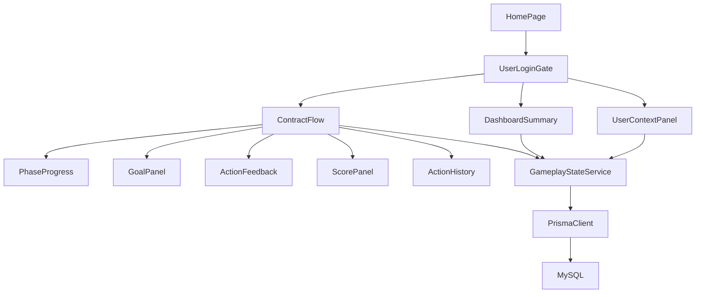
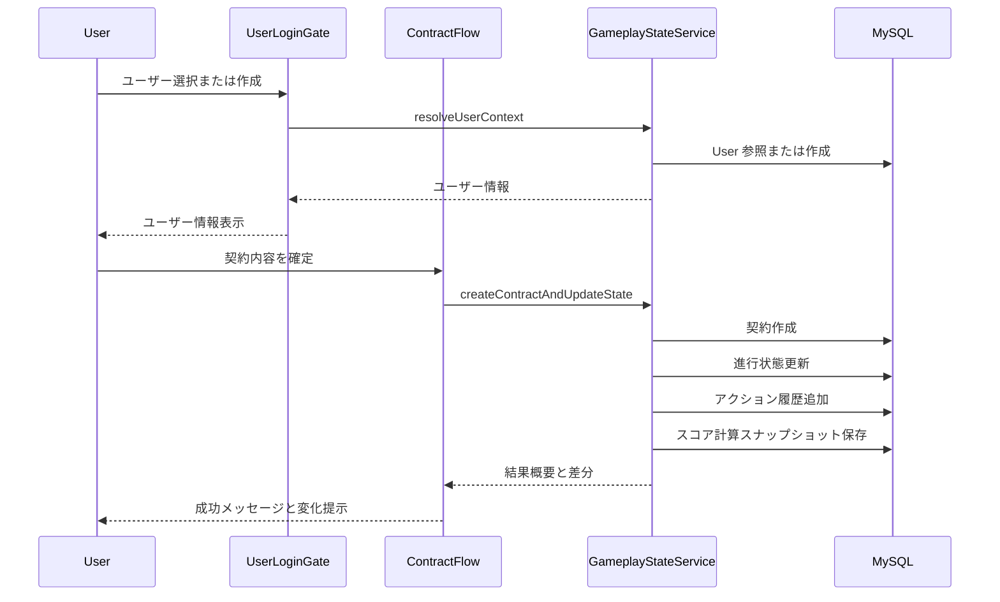

# Design Document: gameplay-ui-enhancement

## Overview
本機能は、契約フローとホーム画面をゲーム体験に近づけるため、進行フェーズ、目標、アクション結果、評価指標、ダッシュボードの可視化を統合する。プレイヤーは進行状況と成果を即時に把握でき、意思決定の連続性と達成感を得られる。

対象ユーザーは契約シミュレーションを操作するプレイヤーであり、UI の導線は「ユーザー選択（ログイン） → ユーザー情報表示 → 契約フロー表示」の順に統一する。本設計は既存の App Router + Server Actions + Prisma 構成を維持しつつ、UI パネル分割とサーバ側状態管理を追加する。

### Goals
- 契約フローの進行フェーズと残りステップを常時可視化する。
- 目標・アクション結果・スコアを同一体験内で提示し、達成状況を追跡できるようにする。
- 再訪時に進行状態と履歴を復元し、ホーム画面での状況把握を強化する。

### Non-Goals
- 契約評価アルゴリズム自体の刷新
- 長期シーズン進行や財務管理シミュレーションの導入
- 外部分析サービスとの連携

## Architecture

### Existing Architecture Analysis
- `ContractFlow` がホーム画面内の契約体験を集約しており、UI 拡張の中心点となる。
- サーバアクションは `contract-actions` と `user-actions` に集約され、Prisma 経由で DB を更新する。
- ホーム画面はデータ取得を `page.tsx` に集約し、UI コンポーネントに渡す構成。

### Architecture Pattern & Boundary Map
**Architecture Integration**:
- Selected pattern: App Router BFF 拡張パターン
- Domain/feature boundaries: UI パネル群（可視化）とサーバ状態管理（進行・履歴・スコア）を分離
- Existing patterns preserved: Server Actions + Prisma、UI は Tailwind ベース
- New components rationale: 進行・目標・履歴・スコアの境界を明確化し、責務分割する
- Steering compliance: Next.js App Router 構成、ドメイン分離方針を維持



### Technology Stack

| Layer | Choice / Version | Role in Feature | Notes |
|-------|------------------|-----------------|-------|
| Frontend / UI | Next.js 15 + React 19 | 契約フローとダッシュボードの UI 拡張 | App Router 継続
| Backend / Services | Server Actions (TypeScript) | 進行状態・履歴・スコアの取得と更新 | 既存パターン維持
| Data / Storage | Prisma + MySQL | 進行状態、目標達成、アクション履歴、スコアの永続化 | 新規モデル追加
| Infrastructure / Runtime | Node.js | App Router 実行環境 | 既存利用

## System Flows



## Requirements Traceability

| Requirement | Summary | Components | Interfaces | Flows |
|-------------|---------|------------|------------|-------|
| 1.1 | フェーズと残りステップ表示 | PhaseProgress, ContractFlow | State | 進行可視化フロー |
| 1.2 | 進行状況の常時可視化 | PhaseProgress | State | 進行可視化フロー |
| 1.3 | フェーズ完了時の更新 | GameplayStateService, PhaseProgress | Service, State | 進行更新フロー |
| 1.4 | 再訪時の復元 | GameplayStateService, ContractFlow | Service, State | 状態復元フロー |
| 1.5 | 進行履歴参照 | ActionHistory, GameplayStateService | Service, State | 履歴取得フロー |
| 2.1 | 目標一覧と達成状況表示 | GoalPanel, GameplayStateService | Service, State | 目標取得フロー |
| 2.2 | 目標達成の更新 | GameplayStateService | Service | 目標更新フロー |
| 2.3 | 無効化や期限切れ理由表示 | GoalPanel | State | 目標取得フロー |
| 2.4 | 達成済み目標の履歴表示 | GoalPanel, ActionHistory | State | 履歴取得フロー |
| 2.5 | 達成可否の視覚識別 | GoalPanel | State | 目標取得フロー |
| 3.1 | アクション結果概要の提示 | ActionFeedback | State | アクション結果フロー |
| 3.2 | 処理中の明示 | ContractFlow, ActionFeedback | State | アクション結果フロー |
| 3.3 | 失敗理由とヒント表示 | ActionFeedback | State | アクション結果フロー |
| 3.4 | 変更点強調表示 | ActionFeedback, ScorePanel | State | アクション結果フロー |
| 3.5 | 直近アクション履歴 | ActionHistory | State | 履歴取得フロー |
| 4.1 | 評価指標の計算提示 | ScorePanel, GameplayStateService | Service, State | スコア更新フロー |
| 4.2 | 指標差分提示 | ScorePanel | State | スコア更新フロー |
| 4.3 | 不足項目の明示 | ScorePanel | State | スコア更新フロー |
| 4.4 | 総合スコア提示 | ScorePanel | State | スコア更新フロー |
| 4.5 | 指標説明提供 | ScorePanel | State | スコア表示フロー |
| 5.1 | リソースと最新状況サマリ | DashboardSummary | State | ダッシュボード取得フロー |
| 5.2 | サマリ項目から詳細誘導 | DashboardSummary | State | ダッシュボード取得フロー |
| 5.3 | 空状態ガイダンス | DashboardSummary, GoalPanel, ActionHistory | State | ダッシュボード取得フロー |
| 5.4 | サマリの最新化 | GameplayStateService, DashboardSummary | Service, State | ダッシュボード更新フロー |
| 5.5 | 次のアクション導線 | DashboardSummary, ContractFlow | State | ダッシュボード取得フロー |

## Components and Interfaces

### Components Summary

| Component | Domain/Layer | Intent | Req Coverage | Key Dependencies (P0/P1) | Contracts |
|-----------|--------------|--------|--------------|--------------------------|-----------|
| HomePage | UI (Server) | ログインゲートと主要パネルを配置する | 5.1, 5.5 | UserLoginGate (P0) | State |
| UserLoginGate | UI (Client) | ユーザー選択後に契約体験を開くゲート | 1.4, 3.2 | UserContextPanel (P0), ContractFlow (P0) | Service, State |
| UserContextPanel | UI (Client) | ログイン中ユーザーの情報表示 | 1.4 | GameplayStateService (P1) | State |
| DashboardSummary | UI (Server) | 主要リソースと次アクションを要約表示 | 5.1, 5.2, 5.3, 5.4, 5.5 | GameplayStateService (P0) | State |
| ContractFlow | UI (Client) | 契約フローと進行体験の中心 UI | 1.1-1.4, 3.1-3.4, 5.5 | GameplayStateService (P0) | Service, State |
| PhaseProgress | UI (Client) | フェーズ進行の可視化 | 1.1-1.3 | ContractFlow (P0) | State |
| GoalPanel | UI (Client) | 目標と達成状況の表示 | 2.1-2.5 | GameplayStateService (P0) | State |
| ActionFeedback | UI (Client) | アクション結果の即時提示 | 3.1-3.4 | ContractFlow (P0) | State |
| ActionHistory | UI (Client) | 直近アクション履歴の表示 | 1.5, 3.5, 2.4 | GameplayStateService (P0) | State |
| ScorePanel | UI (Client) | 指標・スコアの提示 | 4.1-4.5 | GameplayStateService (P0) | State |
| GameplayStateService | Server Actions | 進行状態、目標、履歴、スコアの取得と更新 | 1.3-1.5, 2.2, 3.5, 4.1, 5.4 | Prisma Client (P0) | Service |

### Shared Interfaces & Props

```typescript
export type PhaseStatus = 'NotStarted' | 'InProgress' | 'Completed';

export type BasePanelProps = {
  title: string;
  description?: string;
  emptyState?: { title: string; detail: string; actionLabel?: string; actionHref?: string };
};

export type PhaseProgressState = {
  phaseId: string;
  phaseLabel: string;
  stepIndex: number;
  totalSteps: number;
  status: PhaseStatus;
  updatedAt: string;
};

export type GoalStatus = 'Active' | 'Completed' | 'Expired' | 'Disabled';

export type GoalState = {
  id: string;
  title: string;
  description?: string;
  status: GoalStatus;
  reason?: string;
  progressLabel?: string;
  updatedAt: string;
};

export type ActionResultSummary = {
  id: string;
  actionType: 'ContractCreated' | 'UserSelected' | 'UserCreated' | 'ContractFailed';
  status: 'Success' | 'Failure' | 'Pending';
  message: string;
  hint?: string;
  deltaHighlights?: string[];
  occurredAt: string;
};

export type ScoreMetric = {
  id: string;
  label: string;
  value: number;
  maxValue?: number;
  delta?: number;
  description?: string;
  missingReason?: string;
};

export type ScoreSnapshot = {
  totalScore: number;
  metrics: ScoreMetric[];
  calculatedAt: string;
};
```

### Application / Server Layer

#### GameplayStateService

| Field | Detail |
|-------|--------|
| Intent | 進行状態・目標・履歴・スコアを統合的に取得/更新するサーバアクション群 |
| Requirements | 1.3, 1.4, 1.5, 2.2, 3.5, 4.1, 5.4 |

**Responsibilities & Constraints**
- ユーザー文脈に基づき状態を取得し、未選択時は明確なエラーを返す。
- 進行フェーズの更新はサーバ側で妥当性を検証する。
- 履歴は最新順で取得し、UI の初期負荷を抑える。

**Dependencies**
- Inbound: ContractFlow — 進行・結果の更新 (P0)
- Inbound: DashboardSummary — サマリ取得 (P0)
- Outbound: Prisma Client — 永続化 (P0)

**Contracts**: Service [x]

##### Service Interface
```typescript
export type GameplayDashboardData = {
  phase: PhaseProgressState | null;
  goals: GoalState[];
  recentActions: ActionResultSummary[];
  score: ScoreSnapshot | null;
  summary: {
    playerCount: number;
    teamCount: number;
    activeGoals: number;
    nextActionLabel: string;
  };
};

export type GameplayStateError =
  | { type: 'UserContextMissing'; message: string }
  | { type: 'Validation'; message: string; fields: string[] }
  | { type: 'System'; message: string };

export type GameplayStateResult<T> =
  | { ok: true; data: T }
  | { ok: false; error: GameplayStateError };

export interface GameplayStateService {
  getDashboardData(): Promise<GameplayStateResult<GameplayDashboardData>>;
  updatePhase(input: { phaseId: string; stepIndex: number; totalSteps: number; status: PhaseStatus }): Promise<GameplayStateResult<PhaseProgressState>>;
  recordAction(input: { actionType: ActionResultSummary['actionType']; status: ActionResultSummary['status']; message: string; hint?: string; deltaHighlights?: string[] }): Promise<GameplayStateResult<ActionResultSummary>>;
  refreshScore(input: { contractId?: number }): Promise<GameplayStateResult<ScoreSnapshot>>;
}
```
- Preconditions:
  - ユーザーが選択済みである。
  - `stepIndex` は $0 \leq stepIndex < totalSteps$ を満たす。
- Postconditions:
  - 状態更新時に履歴が追記される。
  - `recordAction` は即時に履歴へ反映される。
- Invariants:
  - `PhaseProgressState.totalSteps` は固定で増減しない。

**Implementation Notes**
- Integration / Validation / Risks:
  - 既存 `contract-actions` の成功/失敗後に `recordAction` と `updatePhase` を呼び出す統合を想定。
  - 履歴取得は最新 10 件などの上限を設けて負荷を抑制。
  - スコア計算は入力不足時に `missingReason` を返し UI に表示。

### UI Layer

#### ContractFlow

| Field | Detail |
|-------|--------|
| Intent | 契約フローの入力体験に進行・目標・結果・スコアを統合する |
| Requirements | 1.1, 1.2, 1.3, 1.4, 3.1, 3.2, 3.3, 3.4, 5.5 |

**Responsibilities & Constraints**
- ユーザー選択が完了した後にのみ表示される。
- アクション処理中は入力を無効化し、結果パネルに処理中状態を提示する。
- 進行状態は `GameplayStateService` から取得して描画する。

**Dependencies**
- Inbound: HomePage — 初期データ提供 (P0)
- Outbound: GameplayStateService — 状態更新・取得 (P0)

**Contracts**: Service [x], State [x]

**Implementation Notes**
- Integration / Validation / Risks:
  - 既存の `createContract` 実行後に `recordAction` と `refreshScore` を呼び出す。
  - `PhaseProgress` / `ActionFeedback` / `ScorePanel` を分割して責務を軽量化。

#### PhaseProgress

| Field | Detail |
|-------|--------|
| Intent | フェーズと残りステップを可視化する |
| Requirements | 1.1, 1.2, 1.3 |

**Dependencies**
- Inbound: ContractFlow — 進行状態データ (P0)

**Contracts**: State [x]

#### GoalPanel

| Field | Detail |
|-------|--------|
| Intent | 目標と達成状況を一覧表示する |
| Requirements | 2.1, 2.3, 2.4, 2.5 |

**Dependencies**
- Inbound: ContractFlow — 目標状態 (P0)
- Outbound: GameplayStateService — 目標更新要求 (P1)

**Contracts**: State [x]

#### ActionFeedback

| Field | Detail |
|-------|--------|
| Intent | 主要アクションの結果と失敗理由を即時提示する |
| Requirements | 3.1, 3.2, 3.3, 3.4 |

**Dependencies**
- Inbound: ContractFlow — 直近アクション結果 (P0)

**Contracts**: State [x]

#### ActionHistory

| Field | Detail |
|-------|--------|
| Intent | 直近アクション履歴と進行履歴を表示する |
| Requirements | 1.5, 2.4, 3.5 |

**Dependencies**
- Inbound: ContractFlow — 履歴データ (P0)

**Contracts**: State [x]

#### ScorePanel

| Field | Detail |
|-------|--------|
| Intent | 評価指標とスコアの提示と差分可視化を行う |
| Requirements | 4.1, 4.2, 4.3, 4.4, 4.5 |

**Dependencies**
- Inbound: ContractFlow — スコア情報 (P0)
- Outbound: GameplayStateService — 再計算要求 (P1)

**Contracts**: State [x]

#### DashboardSummary

| Field | Detail |
|-------|--------|
| Intent | クラブ状況と次のアクションをホーム画面で提示する |
| Requirements | 5.1, 5.2, 5.3, 5.4, 5.5 |

**Dependencies**
- Inbound: HomePage — 初期データ (P0)
- Outbound: GameplayStateService — ダッシュボードデータ取得 (P0)

**Contracts**: State [x]

#### UserLoginGate

| Field | Detail |
|-------|--------|
| Intent | ユーザー選択（ログイン）後にユーザー情報と契約画面を表示する |
| Requirements | 1.4, 3.2 |

**Responsibilities & Constraints**
- ユーザー未選択時はログイン UI を表示し、選択後に契約フローを開く。
- ログイン完了時に `UserContextPanel` と `ContractFlow` を同時表示する。

**Dependencies**
- Inbound: HomePage — 初期配置 (P0)
- Outbound: GameplayStateService — ユーザー文脈の取得 (P0)
- Outbound: UserContextPanel — ユーザー情報表示 (P0)
- Outbound: ContractFlow — 契約体験 (P0)

**Contracts**: Service [x], State [x]

**Implementation Notes**
- Integration / Validation / Risks:
  - 既存 `user-actions` の `getCurrentUser` / `setCurrentUser` / `createUser` を利用し、未選択時はガイドを表示する。

#### UserContextPanel

| Field | Detail |
|-------|--------|
| Intent | 現在のユーザー名と関連情報を表示する |
| Requirements | 1.4 |

**Dependencies**
- Inbound: UserLoginGate — ユーザー情報 (P0)
- Outbound: GameplayStateService — 追加情報取得 (P1)

**Contracts**: State [x]

## Data Models

### Domain Model
- GameplayPhaseState: 進行フェーズとステップを保持する集約。
- GoalState: 目標の達成状態と理由を保持するエンティティ。
- ActionLog: 直近アクションの履歴と結果を保持する。
- ScoreSnapshot: 評価指標と総合スコアのスナップショット。

### Logical Data Model

**Structure Definition**
- `GameplayPhaseState` は `User` と 1:1、進行中のフェーズを保持。
- `PhaseTransitionLog` は `User` と 1:N、フェーズ変更履歴を記録。
- `GoalProgress` は `User` と 1:N、目標のステータスを記録。
- `ActionLog` は `User` と 1:N、直近アクションと差分を記録。
- `ScoreSnapshot` は `User` と 1:N、スコア算出結果を記録。

**Consistency & Integrity**
- 進行状態はユーザー単位で単一行を保持し、更新時に履歴へコピーする。
- 履歴は時系列順に追加のみで削除しない。

### Physical Data Model

**Relational Tables (New)**
- `GameplayPhaseState`
  - `id` (PK), `userId` (FK)
  - `phaseId` (VARCHAR), `phaseLabel` (VARCHAR)
  - `stepIndex` (INT), `totalSteps` (INT)
  - `status` (VARCHAR)
  - `updatedAt` (DATETIME)
- `PhaseTransitionLog`
  - `id` (PK), `userId` (FK)
  - `phaseId` (VARCHAR), `status` (VARCHAR)
  - `stepIndex` (INT), `totalSteps` (INT)
  - `recordedAt` (DATETIME)
- `GoalProgress`
  - `id` (PK), `userId` (FK)
  - `goalKey` (VARCHAR)
  - `status` (VARCHAR), `reason` (VARCHAR)
  - `progressLabel` (VARCHAR)
  - `updatedAt` (DATETIME)
- `ActionLog`
  - `id` (PK), `userId` (FK)
  - `actionType` (VARCHAR), `status` (VARCHAR)
  - `message` (VARCHAR), `hint` (VARCHAR)
  - `deltaHighlights` (JSON)
  - `occurredAt` (DATETIME)
- `ScoreSnapshot`
  - `id` (PK), `userId` (FK)
  - `totalScore` (INT)
  - `metrics` (JSON)
  - `calculatedAt` (DATETIME)

## Error Handling
- ユーザー未選択時は `UserContextMissing` を返し、UI は空状態ガイダンスを表示する。
- 入力不備時は `Validation` エラーで対象フィールドを返し、行動ヒントに反映する。

## Testing Strategy
- サーバアクション: 進行更新、履歴追加、スコア算出の単体テスト。
- UI: 進行表示、空状態、失敗理由表示のレンダリングテスト。

## Security Considerations
- すべての状態はユーザー ID でスコープし、他ユーザーの履歴参照を禁止する。
- Cookie によるユーザー文脈が未設定の場合は処理を拒否する。

## Performance Considerations
- ダッシュボード取得は必要最小フィールドのみ取得し、履歴は最新 N 件に限定する。
- スコア算出は契約作成時にのみ更新し、再計算は明示操作に限定する。
