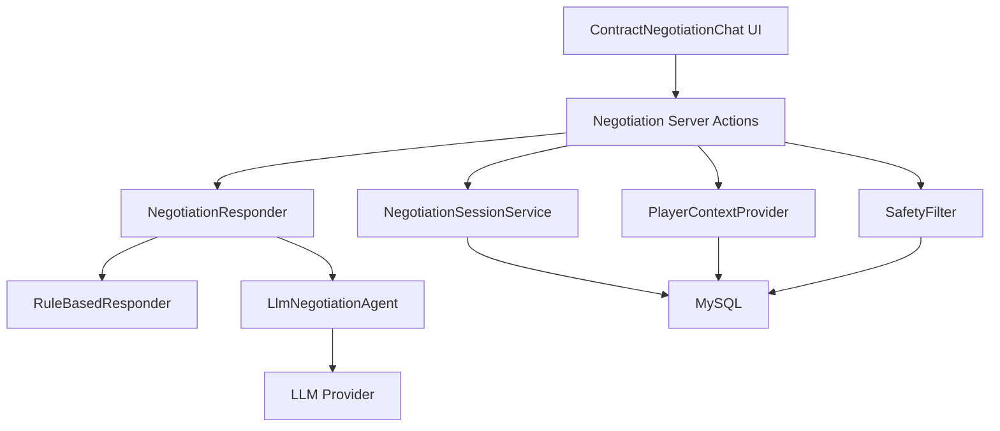
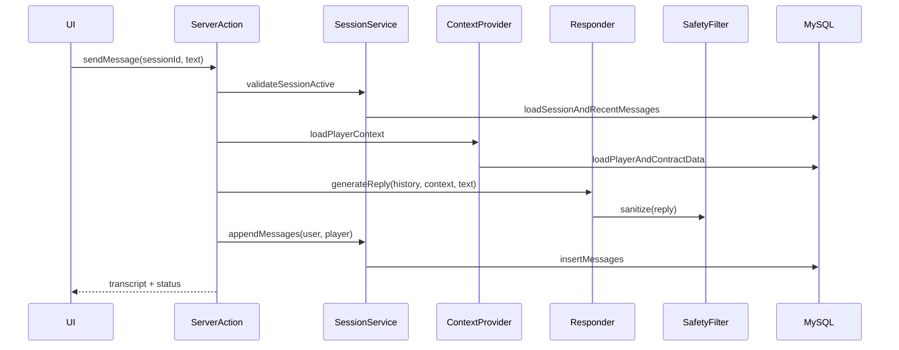
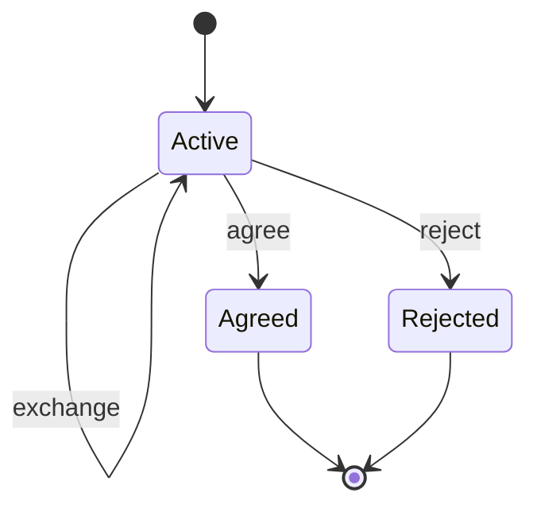

# Design Document

## Overview
この機能は、選手との契約交渉をチャット形式で進められる体験を提供し、交渉の臨場感と納得感を高める。LLM を利用できる環境では LangChain を用いて選手側の返答を生成し、利用できない環境ではルールベースで同等の交渉フローを継続する。

対象ユーザーはクラブ運営者であり、選手情報（年齢、能力、市場価値、契約状況）を踏まえた条件提示とカウンターの往復を通じて、合意または決裂で交渉を完了する。

### Goals
- チャットUIでの交渉（送受信、履歴、ステータス表示）を提供する（1.1, 1.2, 1.3, 1.4, 1.5）
- 交渉セッションの状態遷移（提案、カウンター、合意、決裂）を一貫して管理する（2.1, 2.2, 2.3, 2.4, 2.5）
- LLM を任意化し、失敗時も交渉を継続できる（3.1, 3.2, 3.3, 3.4, 3.5, 7.2）
- LangChain エージェントで会話生成をオーケストレーションし、会話履歴と選手コンテキストを反映する（4.1, 4.2, 4.3, 4.4, 4.5, 5.1, 5.2, 5.3, 5.4, 5.5）

### Non-Goals
- 既存のフォームベース契約フローの削除や置換
- 複数外部ソースからの自動調査（Web検索、ニュース等）を行う高度なツール連携
- LangSmith 等への外部テレメトリ送信を前提にした観測基盤の導入

## Architecture

### Existing Architecture Analysis
- 契約関連のUI/Server Actions/サービスは `src/app/contracts/` に集約され、ActionLog により最近のイベントをダッシュボード表示している。
- 現状の「交渉」は単発の成功/失敗判定と単発台詞生成であり、チャット履歴やセッション概念は存在しない。

### Architecture Pattern & Boundary Map
- Selected pattern: Hybrid（交渉セッションとLLM統合を既存契約処理から分離し、既存UI/ログ基盤と統合）
- Domain/feature boundaries:
  - 交渉: セッション、メッセージ、状態遷移、返答生成
  - 既存契約: 契約レコード（Contract）と既存の推奨/成功率計算は再利用可能
  - ログ: ActionLog は要約イベントを保持、会話履歴は交渉モデルへ保持



### Technology Stack

| Layer | Choice / Version | Role in Feature | Notes |
|-------|------------------|-----------------|-------|
| Frontend | Next.js App Router / React | チャットUI、送信、ステータス表示 | Client component + Server Actions |
| Backend | Next.js Server Actions | 交渉の1ターン処理、DB更新、LLM実行 | サーバ側でのみLLMを実行 |
| Data | Prisma / MySQL | 交渉セッション・メッセージ・監査要約の永続化 | 新規モデル追加 |
| LLM Orchestration | `langchain` (v1) | エージェント実行（4.1） | 依存は最小化 |
| LLM Provider | `@langchain/openai` 等 | LLM接続 | プロバイダは差し替え可能 |

## System Flows

### 交渉メッセージ往復


### 交渉状態遷移


## Requirements Traceability

| Requirement | Summary | Components | Interfaces | Flows |
|-------------|---------|------------|------------|-------|
| 1.1 | 交渉開始時にチャット画面表示 | ContractNegotiationChat UI | UI State | 交渉メッセージ往復 |
| 1.2 | ユーザー送信を履歴へ追加 | ContractNegotiationChat UI, Negotiation Server Actions | sendMessage | 交渉メッセージ往復 |
| 1.3 | 選手応答を履歴へ追加 | Negotiation Server Actions, NegotiationSessionService | generateReply, appendMessages | 交渉メッセージ往復 |
| 1.4 | 交渉ステータス表示 | ContractNegotiationChat UI | UI State | 交渉状態遷移 |
| 1.5 | 不正入力時は送信拒否 | ContractNegotiationChat UI, Negotiation Server Actions | sendMessage | 交渉メッセージ往復 |
| 2.1 | 提示をイベントとして記録 | NegotiationSessionService | appendUserMessage | 交渉メッセージ往復 |
| 2.2 | カウンターをイベントとして記録 | NegotiationSessionService | appendPlayerMessage | 交渉メッセージ往復 |
| 2.3 | 合意を確定 | NegotiationSessionService | finalizeAgreement | 交渉状態遷移 |
| 2.4 | 決裂を確定 | NegotiationSessionService | finalizeRejection | 交渉状態遷移 |
| 2.5 | 確定後の送信拒否 | NegotiationSessionService, Negotiation Server Actions | validateSessionActive | 交渉メッセージ往復 |
| 3.1 | LLM有効無効設定 | NegotiationSettings, Negotiation Server Actions | setLlmEnabled | 交渉メッセージ往復 |
| 3.2 | LLM無効時はルールベース | RuleBasedResponder | NegotiationResponder | 交渉メッセージ往復 |
| 3.3 | LLM有効時はLLM応答 | LlmNegotiationAgent | NegotiationResponder | 交渉メッセージ往復 |
| 3.4 | LLM失敗時フォールバック | LlmNegotiationAgent, RuleBasedResponder | generateReply | 交渉メッセージ往復 |
| 3.5 | 設定変更を以後に反映 | NegotiationSettings, NegotiationSessionService | createSession, setLlmEnabled | 交渉状態遷移 |
| 4.1 | LangChainでオーケストレーション | LlmNegotiationAgent | LlmNegotiationAgentService | 交渉メッセージ往復 |
| 4.2 | 役割と口調の一貫性 | LlmNegotiationAgent | Prompt Contract | 交渉メッセージ往復 |
| 4.3 | 履歴を踏まえた返答 | LlmNegotiationAgent, NegotiationSessionService | loadTranscript | 交渉メッセージ往復 |
| 4.4 | 情報不足時の確認質問 | LlmNegotiationAgent, RuleBasedResponder | generateReply | 交渉メッセージ往復 |
| 4.5 | 根拠を返答に含める | LlmNegotiationAgent | Response Policy | 交渉メッセージ往復 |
| 5.1 | 選手基本情報の取得 | PlayerContextProvider | getPlayerContext | 交渉メッセージ往復 |
| 5.2 | 契約関連情報の取得 | PlayerContextProvider | getPlayerContext | 交渉メッセージ往復 |
| 5.3 | 選手情報をコンテキストに利用 | Negotiation Server Actions, LlmNegotiationAgent | generateReply | 交渉メッセージ往復 |
| 5.4 | 選手情報取得失敗時の継続 | PlayerContextProvider, RuleBasedResponder | getPlayerContext | 交渉メッセージ往復 |
| 5.5 | 交渉中の要約表示 | ContractNegotiationChat UI | UI Props | 交渉メッセージ往復 |
| 6.1 | バージョン情報を確認可能 | package.json, docs | Dependency Policy | - |
| 6.2 | Docs MCPで最新仕様参照 | research.md 運用 | - | - |
| 6.3 | 変更点記録を残す | research.md, changelog | - | - |
| 7.1 | セッション単位の要約ログ | NegotiationAuditService | appendAuditSummary | 交渉メッセージ往復 |
| 7.2 | 不適切出力を安全文に置換 | SafetyFilter | sanitize | 交渉メッセージ往復 |
| 7.3 | 処理中状態を表示 | ContractNegotiationChat UI | UI State | 交渉メッセージ往復 |

## Components and Interfaces

| Component | Domain/Layer | Intent | Req Coverage | Key Dependencies (P0/P1) | Contracts |
|-----------|--------------|--------|--------------|--------------------------|-----------|
| ContractNegotiationChat UI | UI | 会話表示/送信/ステータス表示 | 1.1, 1.2, 1.3, 1.4, 1.5, 5.5, 7.3 | Negotiation Server Actions (P0) | State |
| NegotiationSettings | UI | LLM有効無効の切替UI | 3.1, 3.5 | Negotiation Server Actions (P0) | State |
| Negotiation Server Actions | Backend | 1ターン処理のオーケストレーション | 1.2, 1.3, 1.4, 1.5, 2.1, 2.2, 2.3, 2.4, 2.5, 3.2, 3.3, 3.4, 3.5, 5.3, 5.4, 7.3 | SessionService (P0), Responder (P0), Prisma (P0) | Service |
| NegotiationSessionService | Domain | セッション/メッセージ/状態遷移/永続化 | 2.1, 2.2, 2.3, 2.4, 2.5, 4.3, 7.1 | Prisma (P0) | Service |
| PlayerContextProvider | Domain | 選手/契約情報の要約コンテキスト生成 | 5.1, 5.2, 5.3, 5.4 | Prisma (P0) | Service |
| RuleBasedResponder | Domain | 非LLM返答生成 | 3.2, 4.4, 5.4 | PlayerContextProvider (P1) | Service |
| LlmNegotiationAgent | Domain | LangChainによる返答生成 | 3.3, 3.4, 4.1, 4.2, 4.3, 4.4, 4.5 | langchain (P0), provider (P0) | Service |
| SafetyFilter | Domain | 不適切/無関係出力の置換 | 7.2 | - | Service |
| NegotiationAuditService | Domain | セッション単位の要約ログ | 7.1 | Prisma (P0) | Service |

### Backend

#### Negotiation Server Actions

| Field | Detail |
|-------|--------|
| Intent | 交渉ターン処理の入口（UIから呼ばれる） |
| Requirements | 1.2, 1.3, 1.5, 2.5, 3.2, 3.3, 3.4, 5.3, 7.3 |

**Responsibilities & Constraints**
- 送信前検証（空入力、確定後送信の拒否）
- 必要なDBデータ（セッション/履歴/選手コンテキスト）を収集
- LLM有効時は LlmNegotiationAgent を呼び、失敗時は RuleBasedResponder へフォールバック
- 応答を SafetyFilter に通してから永続化

**Dependencies**
- Inbound: ContractNegotiationChat UI — 送受信（P0）
- Outbound: NegotiationSessionService — セッション/履歴/状態更新（P0）
- Outbound: PlayerContextProvider — 選手要約の生成（P0）
- Outbound: NegotiationResponder — 返答生成（P0）
- Outbound: SafetyFilter — 出力のサニタイズ（P0）

**Contracts**: Service [x] / API [ ] / Event [ ] / Batch [ ] / State [x]

##### Service Interface
```typescript
export type NegotiationStatus = "Active" | "Agreed" | "Rejected";

export type NegotiationMessageRole = "User" | "Player" | "System";

export interface NegotiationMessageView {
  id: string;
  role: NegotiationMessageRole;
  text: string;
  createdAtIso: string;
}

export interface SendMessageInput {
  sessionId: string;
  text: string;
}

export type SendMessageResult =
  | {
      ok: true;
      status: NegotiationStatus;
      transcript: NegotiationMessageView[];
    }
  | {
      ok: false;
      error:
        | { type: "ValidationError"; message: string }
        | { type: "NotFound"; message: string }
        | { type: "Conflict"; message: string }
        | { type: "SystemError"; message: string };
    };

export interface NegotiationActions {
  sendMessage(input: SendMessageInput): Promise<SendMessageResult>;
  setLlmEnabled(input: { sessionId: string; enabled: boolean }): Promise<{ ok: true } | { ok: false; error: { type: "NotFound" | "SystemError"; message: string } }>;
}
```
- Preconditions:
  - `text` はトリム後に1文字以上（1.5）
  - セッションは `Active`（2.5）
- Postconditions:
  - ユーザーメッセージと選手メッセージが永続化され、`transcript` に含まれる（1.2、1.3）
- Invariants:
  - `Agreed`/`Rejected` のセッションに新規メッセージは追加されない（2.5）

### Domain

#### NegotiationSessionService

| Field | Detail |
|-------|--------|
| Intent | 交渉セッションの整合性と永続化を担う |
| Requirements | 2.1, 2.2, 2.3, 2.4, 2.5, 4.3, 7.1 |

**Responsibilities & Constraints**
- セッション作成、状態遷移（Active→Agreed/Rejected）
- メッセージ追記（User/Player/System）
- 交渉確定後は追記不可

**Dependencies**
- Inbound: Negotiation Server Actions — ターン処理（P0）
- Outbound: Prisma — 永続化（P0）

**Contracts**: Service [x] / API [ ] / Event [ ] / Batch [ ] / State [x]

##### Service Interface
```typescript
export interface NegotiationSessionService {
  createSession(input: { userId: string; teamId: string; playerId: string; llmEnabled: boolean }): Promise<{ ok: true; sessionId: string } | { ok: false; error: { type: "NotFound" | "SystemError"; message: string } }>;
  getTranscript(input: { sessionId: string; limit: number }): Promise<{ ok: true; status: NegotiationStatus; messages: NegotiationMessageView[] } | { ok: false; error: { type: "NotFound" | "SystemError"; message: string } }>;
  appendUserMessage(input: { sessionId: string; text: string }): Promise<{ ok: true } | { ok: false; error: { type: "Conflict" | "NotFound" | "SystemError"; message: string } }>;
  appendPlayerMessage(input: { sessionId: string; text: string }): Promise<{ ok: true } | { ok: false; error: { type: "Conflict" | "NotFound" | "SystemError"; message: string } }>;
  finalizeAgreement(input: { sessionId: string }): Promise<{ ok: true } | { ok: false; error: { type: "Conflict" | "NotFound" | "SystemError"; message: string } }>;
  finalizeRejection(input: { sessionId: string }): Promise<{ ok: true } | { ok: false; error: { type: "Conflict" | "NotFound" | "SystemError"; message: string } }>;
}
```

#### PlayerContextProvider

| Field | Detail |
|-------|--------|
| Intent | 交渉用に選手情報を要約したコンテキストを提供 |
| Requirements | 5.1, 5.2, 5.3, 5.4, 5.5 |

**Responsibilities & Constraints**
- Player と関連する契約情報を取得し、交渉に必要な最小要約を作る
- 取得失敗時は “最低限の情報” を返し、交渉は継続可能にする（5.4）

**Dependencies**
- Inbound: Negotiation Server Actions — 応答生成の前提（P0）
- Outbound: Prisma — Player/Contract 参照（P0）

**Contracts**: Service [x] / API [ ] / Event [ ] / Batch [ ] / State [ ]

##### Service Interface
```typescript
export interface PlayerNegotiationContext {
  playerId: string;
  playerName: string;
  age: number | null;
  position: string | null;
  overall: number | null;
  potential: number | null;
  marketValue: number | null;
  currentWage: number | null;
  contractUntilIso: string | null;
  currentClub: string | null;
  notes: string[];
}

export interface PlayerContextProvider {
  getPlayerContext(input: { playerId: string }): Promise<{ ok: true; context: PlayerNegotiationContext } | { ok: false; error: { type: "NotFound" | "SystemError"; message: string } }>;
}
```

#### NegotiationResponder

| Field | Detail |
|-------|--------|
| Intent | “次の選手応答”を生成する抽象境界 |
| Requirements | 3.2, 3.3, 3.4, 4.2, 4.3, 4.4, 4.5 |

**Contracts**: Service [x] / API [ ] / Event [ ] / Batch [ ] / State [ ]

##### Service Interface
```typescript
export interface NegotiationReply {
  text: string;
  nextStatus: NegotiationStatus;
}

export interface NegotiationResponder {
  generateReply(input: {
    llmEnabled: boolean;
    playerContext: PlayerNegotiationContext;
    transcript: NegotiationMessageView[];
    userText: string;
  }): Promise<{ ok: true; reply: NegotiationReply } | { ok: false; error: { type: "SystemError"; message: string } }>;
}
```

#### LlmNegotiationAgent

| Field | Detail |
|-------|--------|
| Intent | LangChainで返答生成を実行し、失敗時は例外を上位へ返す |
| Requirements | 4.1, 4.2, 4.3, 4.4, 4.5, 3.4 |

**Responsibilities & Constraints**
- 役割（選手本人または代理人）と口調を固定する
- 会話履歴と選手コンテキストをプロンプトへ注入する
- 情報不足時は確認質問を返す（4.4）

**Dependencies**
- External: langchain — `createAgent` を利用（P0）
- External: provider package — モデル呼び出し（P0）

**Contracts**: Service [x] / API [ ] / Event [ ] / Batch [ ] / State [ ]

##### Service Interface
```typescript
export interface LlmNegotiationAgentService {
  generate(input: {
    playerContext: PlayerNegotiationContext;
    transcript: NegotiationMessageView[];
    userText: string;
  }): Promise<{ ok: true; replyText: string } | { ok: false; error: { type: "ConfigError" | "Timeout" | "ProviderError"; message: string } }>;
}
```

#### SafetyFilter

| Field | Detail |
|-------|--------|
| Intent | 不適切または破綻した出力を安全な文へ置換 |
| Requirements | 7.2 |

**Contracts**: Service [x] / API [ ] / Event [ ] / Batch [ ] / State [ ]

##### Service Interface
```typescript
export interface SafetyFilter {
  sanitize(input: { text: string }): { text: string; replaced: boolean; reason: string | null };
}
```

#### NegotiationAuditService

| Field | Detail |
|-------|--------|
| Intent | セッション単位の要約ログを追跡する |
| Requirements | 7.1 |

**Contracts**: Service [x] / API [ ] / Event [ ] / Batch [ ] / State [x]

##### Service Interface
```typescript
export interface NegotiationAuditService {
  appendTurnSummary(input: {
    sessionId: string;
    llmUsed: boolean;
    userTextSummary: string;
    playerTextSummary: string;
    errorCode: string | null;
  }): Promise<{ ok: true } | { ok: false; error: { type: "NotFound" | "SystemError"; message: string } }>;
}
```

## Data Models

### Domain Model
- Aggregate: NegotiationSession
  - Invariant: `status` が `Agreed`/`Rejected` の場合、メッセージ追加は禁止（2.5）
  - Invariant: セッションは `userId`/`teamId`/`playerId` に紐づく
- Entity: NegotiationMessage
  - `role`（User/Player/System）と `text` を保持

### Logical Data Model
- NegotiationSession 1 --- N NegotiationMessage
- NegotiationSession 1 --- N NegotiationAuditEntry（任意、要約ログ）

### Physical Data Model
- 追加モデル（Prisma想定）
  - `NegotiationSession`: `id`, `userId`, `teamId`, `playerId`, `status`, `llmEnabled`, `createdAt`, `updatedAt`
  - `NegotiationMessage`: `id`, `sessionId`, `role`, `text`, `createdAt`
  - `NegotiationAuditEntry`: `id`, `sessionId`, `llmUsed`, `userTextSummary`, `playerTextSummary`, `errorCode`, `createdAt`

## Error Handling

### Error Strategy
- 入力検証は UI と Server Actions の両方で行い、ユーザーに即時に分かるメッセージを返す（1.5）
- LLM失敗は「交渉継続」を優先し、ルールベースへフォールバックする（3.4）
- 確定後の追加送信は Conflict として拒否する（2.5）

### Error Categories and Responses
- User Errors: 空入力、確定後送信、存在しないセッション
- System Errors: DB障害、LLMプロバイダ障害、タイムアウト

### Monitoring
- セッション単位の要約ログ（7.1）をDBに保持し、失敗理由（errorCode）を追跡可能にする

## Testing Strategy
- Unit Tests
  - RuleBasedResponder が空入力/情報不足/通常応答を正しく分岐する
  - SafetyFilter が不適切文を置換する
  - SessionService が状態遷移と追記禁止（2.5）を守る
- Integration Tests
  - Server Action が LLM無効時にルールベースで応答し、履歴が永続化される
  - LLM有効だが失敗時にフォールバックされ、交渉が継続する（3.4）
- E2E/UI Tests
  - 送信、処理中表示、履歴表示、ステータス表示（1.x、7.3）

## Security Considerations
- APIキーなどの秘密情報はサーバ側環境変数で管理し、クライアントへ送らない
- 監査ログは全文保存を前提にせず、要約と最小メタデータを基本にする（7.1）
- 不適切出力は SafetyFilter により置換し、UIへそのまま表示しない（7.2）
