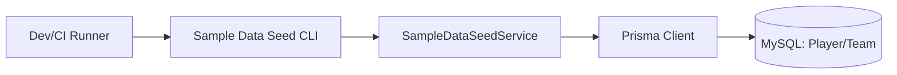
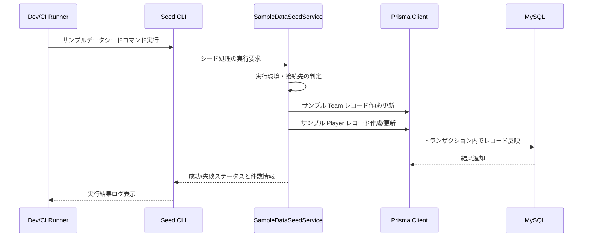

# Technical Design: sample-data-seed

## Overview 
本機能は、FootballContractSim において開発者・テスター・デモ利用者が起動直後から契約シミュレーションを試せるようにするためのサンプルデータシード機能を提供する。Player / Team ドメインに対して代表的なレコードを投入し、一覧・フォーム UI から即座に現実的なデータを扱える状態を作ることが目的である。

主な利用者は、ローカル開発環境や CI 環境で動作確認を行う開発者、およびデモ環境で機能紹介を行う担当者である。これらの利用者は、サンプルデータシードを 1 コマンドで実行し、安定したデータセットを再現したい。

本機能により、初期状態が空データであることによるテストや UI 確認の手間を削減し、Player / Team 機能の開発・回帰テストを効率化する。また、将来的なドメイン拡張（リーグ・財務など）の検証用データを積み上げる土台となる。

### Goals
- Player / Team に対する代表的なサンプルデータセットを、Prisma 経由で一貫して投入できること。
- 同一・異なる環境でサンプルデータシードを再実行しても、データ構成が安定して再現されること。
- 開発・検証環境では簡便に利用できつつ、本番相当環境での誤実行を防止できること。

### Non-Goals
- 管理 UI からのサンプルデータ投入操作（Web 画面での「シード実行」ボタンなど）は本仕様の対象外とする。
- Player / Team 以外のドメイン（リーグ、試合、財務など）へのサンプルデータ投入は含めない。
- Prisma スキーマ自体の拡張や、既存マイグレーションの再設計は行わない。

## Architecture

### Existing Architecture Analysis
- Next.js App Router 構成により、UI / API / サーバアクションは src/app/ 配下に集約されている。
- ドメイン知識（ポジション定義など）は src/domain/ に分離され、インフラ系共通処理は src/lib/（例: prisma クライアント）に集約されている。
- データベースアクセスは Prisma 経由で MySQL に対して行われ、Player / Team は既にスキーマ定義済みである。
- 既存コードにはサンプルデータシードやバッチ処理の仕組みは存在しないため、本機能は新たなバッチ的コンポーネントを追加する拡張となる。

### Architecture Pattern & Boundary Map
**Architecture Integration**:
- Selected pattern: Prisma を利用した単一バッチスクリプト（CLI）パターン。ドメインは既存の Player / Team モデルをそのまま利用し、アプリケーション境界の外側（Next.js ルートの外）から DB へ直接アクセスする。
- Domain/feature boundaries: サンプルデータシードの責務を「開発・検証用データの投入」に限定し、アプリケーション本体のビジネスロジックや UI からは独立したバッチコンポーネントとして扱う。
- Existing patterns preserved: Prisma を用いた型安全な DB アクセス、src/lib/prisma.ts によるクライアント集約、ドメイン分離の方針を維持する。
- New components rationale: サンプルデータ投入処理を再利用しやすくし、環境制御・エラーハンドリング・可観測性の要件を満たすため、専用のシードサービスと CLI エントリポイントを設計する。
- Steering compliance: ドメイン分離・型安全・エラーハンドリングと可観測性を重視する steering に準拠し、設計上も Prisma スキーマと型定義を基点とした構成とする。



### Technology Stack

| Layer | Choice / Version | Role in Feature | Notes |
|-------|------------------|-----------------|-------|
| Backend / Services | Node.js + TypeScript | CLI とシードサービスの実行ランタイム | 既存 Next.js プロジェクトと同一環境 |
| Data / Storage | Prisma (prisma-client-js) + MySQL | Player / Team へのサンプルデータ投入 | 既存スキーマを利用し、追加テーブルは定義しない |
| Infrastructure / Runtime | Dev Container + Docker | シードスクリプトの実行環境 | CI / ローカルから同一コマンドで実行可能にする |

## System Flows

本機能はシンプルなバッチ的処理であり、HTTP 経由の複雑なフローは持たない。ここではシード実行時の高レベルな処理フローのみを示す。



## Requirements Traceability

| Requirement | Summary | Components | Interfaces | Flows |
|-------------|---------|------------|------------|-------|
| 1 | サンプル Player/Team データセットを提供する | SampleDataSeedService, SampleDataSeedCLI | Prisma クライアントを介した DB アクセス | シード実行フロー |
| 2 | サンプルデータの再現性と一貫性を保つ | SampleDataSeedService | Player/Team 向けの upsert ロジック | 再実行時の処理分岐 |
| 3 | 環境制御と安全な実行を担保する | SampleDataSeedService | 実行環境判定とガードインタフェース | 実行前チェックフロー |
| 4 | 実行結果とエラーの可観測性を提供する | SampleDataSeedService, SampleDataSeedCLI | ログ/メトリクス用の出力インタフェース | シード完了時の結果報告フロー |

## Components and Interfaces

### Components Summary

| Component | Domain/Layer | Intent | Req Coverage | Key Dependencies (P0/P1) | Contracts |
|-----------|--------------|--------|--------------|--------------------------|-----------|
| SampleDataSeedService | Application / Batch | Player / Team に対するサンプルデータシード処理を集約するサービス | 1, 2, 3, 4 | Prisma Client (P0), 環境判定ロジック (P0) | Service, Batch |
| SampleDataSeedCLI | Infrastructure / CLI | コマンドラインからシード処理を起動し、結果を表示するエントリポイント | 1, 4 | SampleDataSeedService (P0) | Batch |

### Application Layer

#### SampleDataSeedService

| Field | Detail |
|-------|--------|
| Intent | Player / Team へのサンプルデータ投入と再実行時の一貫性・安全性を担保するバッチサービス |
| Requirements | 1, 2, 3, 4 |
| Owner / Reviewers | TBD |

**Responsibilities & Constraints**
- Player / Team に対して代表的なサンプルレコード集合を定義し、Prisma 経由で作成・更新する。
- 再実行時にも同一データ構成となるよう、キー属性に基づく upsert 戦略を用いる（例: Team.name, Player.name + position）。
- 実行環境や接続先 DB を判定し、許可された環境のみでシード処理を実行する。
- 実行結果（作成件数・更新件数・失敗件数）やエラー詳細を呼び出し元に返却する。

**Dependencies**
- Inbound: SampleDataSeedCLI — シード処理呼び出し (P0)
- Outbound: Prisma Client — Player / Team への永続化処理 (P0)
- External: ログ/モニタリング基盤（標準出力または既存ロギング）— 実行結果の記録 (P1)

**Contracts**: Service [x] / API [ ] / Event [ ] / Batch [x] / State [ ]

##### Service Interface
```typescript
interface SampleDataSeedService {
  run(options: SampleDataSeedOptions): Promise<SampleDataSeedResult>;
}

interface SampleDataSeedOptions {
  environment: string; // 実行環境のラベル（"development" | "test" など）
  dryRun?: boolean; // 実際には書き込まず、差分のみを確認するモード
}

interface SampleDataSeedResult {
  playersCreated: number;
  playersUpdated: number;
  teamsCreated: number;
  teamsUpdated: number;
  errors: SampleDataSeedError[];
}

interface SampleDataSeedError {
  entity: "Player" | "Team";
  identifier: string; // 例: name など
  message: string;
}
```
- Preconditions:
  - Prisma クライアントが有効な DB 接続を持っていること。
  - options.environment が既知の値であり、シード実行が許可されている環境であること。
- Postconditions:
  - 許可された環境において、定義されたサンプルデータセットが Player / Team に挿入または更新される。
  - 実行結果が SampleDataSeedResult として返却され、呼び出し元でログ・可視化可能である。
- Invariants:
  - サンプルデータセットのキー属性は一意性を維持し、再実行時にも重複レコードが増えない。

##### Batch / Job Contract
- Trigger: CLI からの明示的なコマンド実行、または CI ジョブからの node スクリプト実行。
- Input / validation:
  - options.environment に基づき、許可された環境かどうかを検証する。
  - 必要に応じて環境変数（NODE_ENV や独自フラグ）を参照して追加検証を行う。
- Output / destination:
  - 実行結果を標準出力またはログに記録する。
  - エラー詳細は SampleDataSeedError 配列として返却し、CI などでの解析を可能にする。
- Idempotency & recovery:
  - upsert 戦略により、同一データに対して複数回実行してもデータ構成が変化しないようにする。
  - 実行途中でエラーが発生した場合、トランザクション単位でロールバックされ、不整合状態を残さない設計とする。

**Implementation Notes**
- Integration: src/lib/prisma.ts を通じて Prisma クライアントを利用し、Player / Team モデルに対してバルク upsert を行う。
- Validation: 実行環境判定ロジックを最初に行い、許可されない環境では DB 書き込みを一切行わない。
- Risks: サンプルデータ定義が増えるとサービス内の定数群が肥大化するため、将来的には別モジュールへの切り出しを検討する。

### Infrastructure Layer

#### SampleDataSeedCLI

| Field | Detail |
|-------|--------|
| Intent | コマンドラインから SampleDataSeedService を呼び出し、結果をコンソールに表示する |
| Requirements | 1, 4 |
| Owner / Reviewers | TBD |

**Responsibilities & Constraints**
- 実行引数や環境変数から environment/dryRun などのオプションを解釈する。
- SampleDataSeedService を呼び出し、結果のサマリ（件数・エラー有無）を標準出力に整形して表示する。
- 終了コードで成功/失敗を表現し、CI などから判定可能にする。

**Dependencies**
- Inbound: Dev/CI Runner — npm script や node コマンドからの起動 (P0)
- Outbound: SampleDataSeedService — 実際のシード処理実行 (P0)
- External: Node 標準のプロセス API — 引数・終了コード制御 (P1)

**Contracts**: Service [ ] / API [ ] / Event [ ] / Batch [x] / State [ ]

##### Batch / Job Contract
- Trigger: npm script（例: npm run seed:sample）や CI ステップからの呼び出し。
- Input / validation:
  - コマンドライン引数または環境変数から environment/dryRun を読み取り、妥当性チェックを行う。
- Output / destination:
  - 実行結果をコンソール出力し、人間および CI ログから確認できるようにする。
- Idempotency & recovery:
  - SampleDataSeedService 側の idempotency を前提とし、CLI 自身は複数回実行を許容する。

**Implementation Notes**
- Integration: package.json にシード用スクリプトを追加し、開発者が 1 コマンドで実行できるようにすることを推奨する。
- Validation: 不正な引数や未知の environment 値が指定された場合はエラーとして終了し、シード処理を実行しない。
- Risks: CLI のオプション仕様が増えすぎると学習コストが上がるため、最小限のインタフェースに留める。

## Data Models

### Domain Model
- Player: 既存の Player モデルを利用し、サンプルデータではポジション、年齢、overall/potential、marketValue、currentClub などを代表的な値で設定する。
- Team: 既存の Team モデルを利用し、サンプルデータでは name, country, foundedYear を設定する。
- 関係性: Prisma スキーマ上では Player と Team の外部キー関係は定義されていないが、シードデータでは Player.currentClub に Team.name を一致させるなど、論理的な関連を持たせる。

### Logical Data Model

**Structure Definition**:
- Player: id, name, position, nationality, age, overall, potential, currentClub, contractUntil, marketValue, wage, createdAt, updatedAt
- Team: id, name, country, foundedYear, createdAt, updatedAt

**Consistency & Integrity**:
- Player.name + position をサンプルデータにおける論理キーとして扱い、再実行時に同一エンティティとみなして upsert を行う。
- Team.name を論理キーとして扱い、サンプルデータの再実行時にも同一チームとして upsert する。

### Physical Data Model
- 既存の Prisma スキーマ（prisma/schema.prisma）を前提とし、新たなテーブルやインデックスは追加しない。
- シード処理は既存のインデックス（name, position, overall など）を前提とした通常の INSERT/UPDATE として動作する。

### Data Contracts & Integration
- API レベルで新たなデータ契約は追加しない。本機能は DB 直下のサンプルデータに対する変更のみを行い、既存 API/画面はそのデータをそのまま利用する。

## Error Handling

### Error Strategy
- 環境判定エラー: 許可されていない environment でシードが実行されそうな場合は、早期に処理を中断しエラーメッセージを返す。
- データ整合性エラー: Prisma からのバリデーションエラーや一意制約違反などを捕捉し、どのエンティティで何が失敗したかを SampleDataSeedError として収集する。
- システムエラー: DB 接続障害などのシステムエラーは、全体のシード処理を失敗として扱い、再試行やトラブルシューティングのための情報をログに残す。

### Error Categories and Responses
- User Errors (4xx 相当): 不正な environment や引数 — CLI はエラーメッセージを表示し、非ゼロ終了コードで終了する。
- System Errors (5xx 相当): DB 接続エラーや Prisma ランタイムエラー — ログに詳細を出力し、再試行可能な状態を保つ。
- Business Logic Errors (422 相当): サンプルデータ定義とスキーマの不整合（例: 必須フィールド欠落）— エラー件数を集計し、どのサンプルエントリを修正すべきか特定可能な情報を返す。

### Monitoring
- 最低限として標準出力ログに、実行開始時刻・終了時刻・作成/更新件数・エラー件数を出力する。
- 将来的に既存のロギング/モニタリング基盤が導入された場合は、同じフォーマットでメトリクスやログに連携できるようにする。

## Testing Strategy

- Unit Tests:
  - SampleDataSeedService.run の正常系（サンプルセットが期待通りに upsert される）。
  - 環境判定ロジック（許可/不許可の environment に対する動作）。
  - エラー収集ロジック（部分的な失敗があっても結果として集約される）。
- Integration Tests:
  - 実際の DB（テスト用）に対してシードを実行し、Player / Team テーブルの件数と代表値を検証する。
  - 再実行時にレコード件数が増加せず、更新のみが行われることを確認する。
- E2E/UI Tests:
  - シード実行後に UI 上の Player / Team 一覧ページで想定したサンプルデータが表示されることを確認する。
- Performance/Load:
  - 将来的にサンプルデータ件数が増えた場合にも、開発利用に支障のない時間内で完了することを目安とする（具体的な数値目標は今後の利用状況に応じて設定）。

## Optional Sections

### Security Considerations
- サンプルデータシードは開発・検証環境での利用を前提としており、本番相当環境では environment 判定により実行をブロックする。
- データ内容自体はテスト用であり、個人情報や機密情報は含めない前提とする。

### Performance & Scalability
- 現状のスコープではサンプルデータ件数は限定的であり、大規模スケール要件はない。
- 将来的に大量データのシミュレーションが必要になった場合は、バッチ処理の分割や非同期実行を検討する。

### Migration Strategy
- 本機能は既存スキーマに対する読み書きのみを行い、新たなマイグレーションは伴わない。
- Player / Team スキーマが変更された場合は、サンプルデータ定義を更新し、必要に応じて要件・設計も改訂する。

## Supporting References (Optional)
- 詳細な検討や代替案・リスクの整理は [.kiro/specs/sample-data-seed/research.md](.kiro/specs/sample-data-seed/research.md) に記録している。
