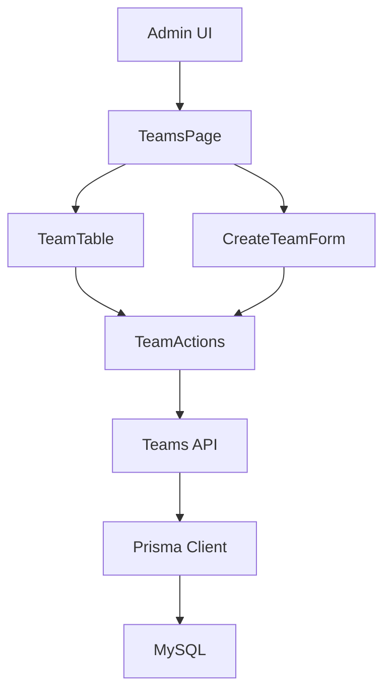

# Team CRUD Design

## Overview
本機能は、FootballContractSim におけるクラブチーム情報を管理するための CRUD 機能を提供する。管理者はチームを登録・閲覧・検索・編集・削除でき、将来のリーグ・シーズン進行・財政シミュレーションの土台となるチームデータを一貫した形で蓄積できる。

主な利用者はアプリケーション管理者（開発者含む）であり、`players` 機能と同様の UI / API パターンでチームデータを扱うことで、学習コストを抑えつつ機能を拡張する。

### Goals
- Goal 1: チーム基本情報（名称など）を安全に登録・更新・削除できること（Requirements 1, 3, 4）。
- Goal 2: 登録済みチームを一覧・検索し、必要なチームを特定しやすい UI / API を提供すること（Requirement 2）。
- Goal 3: 無効な入力や内部エラー時にも、データ整合性を維持しつつ分かりやすいエラー応答を返すこと（Requirement 5）。

### Non-Goals
- Team と Player 間の外部キー制約や完全な正規化（将来のリーグ・財政機能追加時に検討）。
- 複数クラブ間のリーグ・大会ロジックや財政シミュレーションそのもの。
- チームごとの詳細なスタジアム情報やブランド要素など、シミュレーションに必須でない付加情報。

## Architecture

### Existing Architecture Analysis
- App Router + Prisma + MySQL を用いたフルスタック構成が既に存在し、players 機能が CRUD パターンのリファレンスとなっている。
- `src/app/players` と `src/app/api/players` が機能別縦割り構造を形成し、UI・サーバアクション・API ルート・Prisma モデルが疎結合に構成されている。
- Team CRUD は、同様の構成を `teams` 機能として追加することで、既存コードとの整合性を維持する。

### Architecture Pattern & Boundary Map
- 選択パターン: Vertical Slice per Feature（機能ごとの縦割り構造）。
- ドメイン境界:
  - Team ドメイン: チームエンティティとその CRUD ロジックを担当。
  - UI 層: /teams 管理画面での表示・操作を担当。
  - API 層: `/api/teams` で他クライアントからの HTTP アクセスを受け付ける。
  - データ層: Prisma を介した Team テーブルの読み書きを担当。
- 既存パターンの維持:
  - players 機能と同様に App Router 直下に UI と API を配置し、BFF として振る舞う。



### Technology Stack

| Layer | Choice / Version | Role in Feature | Notes |
|-------|------------------|-----------------|-------|
| Frontend / UI | Next.js 15 + React 19 | /teams ページ、TeamTable, CreateTeamForm | players 機能と同様のパターンを踏襲 |
| Backend / Services | Next.js Route Handlers, Server Actions | TeamActions, API ルート | サーバ側でバリデーションとビジネスルールを集中管理 |
| Data / Storage | Prisma + MySQL | Team モデルの CRUD | 既存 Player モデルと同一 DB に共存 |
| Infrastructure / Runtime | Node.js (Dev Container) | 実行環境 | 既存構成をそのまま利用 |

## System Flows
本機能は players 機能と同様の単純な CRUD であり、複雑な分岐フローはないため、個別のシーケンス図は省略する。高レベルでは以下の 3 フローを想定する:
- チーム新規作成: Admin UI → Server Action → Prisma → 再描画。
- チーム編集: Admin UI（インライン編集）→ Server Action → Prisma → 再描画。
- チーム削除: Admin UI → Server Action → Prisma → 再描画。

## Requirements Traceability

| Requirement | Summary | Components | Interfaces | Flows |
|-------------|---------|------------|------------|-------|
| 1 | チーム基本情報の登録 | TeamsPage, CreateTeamForm, TeamActions, TeamsApi, Team モデル | Server Action API, HTTP POST /api/teams | チーム新規作成フロー |
| 2 | チーム一覧表示と検索 | TeamsPage, TeamTable, TeamsApi, Team モデル | HTTP GET /api/teams | 一覧取得フロー |
| 3 | チーム詳細閲覧と編集 | TeamsPage, TeamTable, TeamActions, TeamsApi, Team モデル | Server Action API, HTTP GET/PUT /api/teams/:id | 詳細取得・編集フロー |
| 4 | チーム削除と参照整合性 | TeamTable, TeamActions, TeamsApi, Team モデル | Server Action API, HTTP DELETE /api/teams/:id | 削除フロー |
| 5 | バリデーション・エラーハンドリング・基本制約 | TeamActions, TeamsApi | サーバアクション引数、HTTP エラーレスポンス | 入力検証・エラー応答フロー |

## Components and Interfaces

### Components Summary

| Component | Domain/Layer | Intent | Req Coverage | Key Dependencies (P0/P1) | Contracts |
|-----------|--------------|--------|--------------|--------------------------|-----------|
| TeamsPage | UI (Server Component) | チーム一覧と新規作成フォームをレイアウトとしてまとめる | 1, 2 | TeamTable (P0), CreateTeamForm (P0), Prisma (P1) | State |
| TeamTable | UI (Client Component) | 既存チームの一覧表示・インライン編集・削除操作を提供 | 2, 3, 4 | TeamActions (P0) | Service, State |
| CreateTeamForm | UI (Client Component) | 新規チームの入力フォームと送信ロジックを提供 | 1, 5 | TeamActions (P0) | Service, State |
| TeamActions | Server Actions | 入力バリデーションと Team モデル CRUD をカプセル化 | 1, 3, 4, 5 | Prisma Team モデル (P0) | Service |
| TeamsApi | API Route Handlers | HTTP 経由で Team CRUD のエンドポイントを提供 | 1, 2, 3, 4, 5 | Prisma Team モデル (P0) | API |
| Team モデル | Data / Domain | チームエンティティのスキーマと永続化ルールを定義 | 1, 2, 3, 4, 5 | MySQL (P0) | State |

### UI Layer

#### TeamsPage

| Field | Detail |
|-------|--------|
| Intent | チーム一覧と作成フォームを一つのページにまとめるサーバコンポーネント |
| Requirements | 1, 2 |

**Responsibilities & Constraints**
- 初期表示時に Prisma を通じて Team 一覧を取得し、TeamTable に渡す。
- CreateTeamForm を同一ページ内に配置し、作成完了後に一覧を再読み込みできるようにする。
- players と同様に `dynamic = 'force-dynamic'` 相当の設定を利用し、最新データを常に取得する。

**Dependencies**
- Inbound: Admin UI ルート `/teams` — 管理者によるアクセス (P0)。
- Outbound: TeamTable — 一覧表示とインライン編集 (P0)。
- Outbound: CreateTeamForm — 新規作成操作 (P0)。
- Outbound: Prisma Client — Team 一覧取得 (P1)。

**Contracts**: State [x]

**Implementation Notes**
- Integration / Validation / Risks:
  - players の `PlayersPage` とほぼ同じパターンを適用し、一覧ソート順や件数は要件に応じて TeamActions / TeamsApi と連携して調整する。

#### TeamTable

| Field | Detail |
|-------|--------|
| Intent | チーム一覧に対してインライン編集・削除を提供するクライアントコンポーネント |
| Requirements | 2, 3, 4 |

**Responsibilities & Constraints**
- 初期 Team 配列を受け取り、クライアント側でローカル状態として保持・更新する。
- 編集モードの切り替え、フォーム送信処理を行い、TeamActions に更新リクエストを委譲する。
- 削除操作に対して楽観的 UI 更新を行い、TeamActions の結果に追随する。

**Dependencies**
- Inbound: TeamsPage — 初期 Team 配列の提供 (P0)。
- Outbound: TeamActions — 更新・削除ロジックの実行 (P0)。

**Contracts**: Service [x], State [x]

##### Service Interface (UI → Server Action)
```typescript
interface UpdateTeamInput {
  name?: string;
  country?: string;
  foundedYear?: number;
}

interface DeleteTeamResult {
  success: boolean;
}
```
- Preconditions: ID が数値として解釈可能であり、更新対象項目がドメイン制約に沿っていること。
- Postconditions: 成功時は Team モデルが更新または削除され、再取得した一覧に反映されること。

**Implementation Notes**
- Integration / Validation / Risks:
  - フォームからの入力値は文字列のため、年や数値は UI で一度 number 変換を行い、NaN は無視またはエラーとして扱う方針を文書化する。

#### CreateTeamForm

| Field | Detail |
|-------|--------|
| Intent | 新規チームの作成フォームと送信ロジックを提供するクライアントコンポーネント |
| Requirements | 1, 5 |

**Responsibilities & Constraints**
- 必須項目（例: name）をクライアント側で簡易チェックし、明らかに不正な入力をサーバ送信前に弾く。
- 送信時に TeamActions の create 関数を呼び出し、成功時にはフォームのクリアと一覧のリフレッシュを行う。

**Dependencies**
- Inbound: TeamsPage — ページ内への配置 (P0)。
- Outbound: TeamActions — 作成ロジックの実行 (P0)。

**Contracts**: Service [x], State [x]

##### Service Interface (UI → Server Action)
```typescript
interface CreateTeamInput {
  name: string;
  country?: string | null;
  foundedYear?: number | null;
}
```
- Preconditions: name が非空文字列であり、foundedYear が存在する場合は合理的な範囲内の数値であること。
- Postconditions: Team モデルに新規レコードが追加され、一覧に反映されること。

**Implementation Notes**
- Integration / Validation / Risks:
  - バリデーションメッセージは i18n ではなく英語固定で簡易実装とし、将来的に共通バリデーションレイヤーに集約できるようにする。

### Server Layer

#### TeamActions

| Field | Detail |
|-------|--------|
| Intent | サーバアクションとして Team の作成・更新・削除をカプセル化する |
| Requirements | 1, 3, 4, 5 |

**Responsibilities & Constraints**
- 入力 DTO を受け取り、型安全なバリデーションとドメインルールを適用する。
- Prisma を用いて Team モデルを読み書きし、エラー時には要件に沿った例外を投げる。
- 成功時には `revalidatePath('/teams')` を用いるなどして UI とデータの整合性を保つ。

**Dependencies**
- Inbound: TeamTable, CreateTeamForm — サーバアクション呼び出し (P0)。
- Outbound: Prisma Client — Team モデル CRUD (P0)。

**Contracts**: Service [x]

##### Service Interface
```typescript
interface BaseTeamInput {
  name: string;
  country?: string | null;
  foundedYear?: number | null;
}

export async function createTeam(input: BaseTeamInput): Promise<Team>;
export async function updateTeam(id: number, input: Partial<BaseTeamInput>): Promise<Team>;
export async function deleteTeam(id: number): Promise<{ success: boolean }>;
```
- Preconditions:
  - `createTeam`: name が必須であり、foundedYear が存在する場合は許容範囲内の数値であること。
  - `updateTeam`: id が有効な数値であり、入力が空でないこと。
  - `deleteTeam`: id が有効な数値であり、存在しない ID に対しては適切なエラーを返すこと。
- Postconditions:
  - `createTeam`: Team レコードが 1 件追加される。
  - `updateTeam`: 対象 Team レコードが更新される。
  - `deleteTeam`: 対象 Team レコードが削除され、結果が `{ success: true }` で返る。

**Implementation Notes**
- Integration / Validation / Risks:
  - バリデーションロジックは players の `BaseInput` バリデーションに準拠しつつ、Team 固有の制約（例: foundedYear の範囲）を追加する。

#### TeamsApi

| Field | Detail |
|-------|--------|
| Intent | HTTP 経由で Team CRUD を提供する Route Handlers 群 |
| Requirements | 1, 2, 3, 4, 5 |

**Responsibilities & Constraints**
- GET `/api/teams`: take/skip パラメータに基づく一覧取得と総件数の返却。
- POST `/api/teams`: JSON ボディから入力を受け取り、TeamActions と同等のバリデーションを実施した上で Team を作成する。
- GET `/api/teams/:id`: ID に基づく Team 単体取得と 404 応答。
- PUT `/api/teams/:id`: 部分更新の入力を受け取り、Team 更新を行う。
- DELETE `/api/teams/:id`: Team 削除を行い、結果を JSON で返す。

**Dependencies**
- Inbound: 外部クライアント、将来の統合ポイント (P1)。
- Outbound: Prisma Client — Team モデル CRUD (P0)。

**Contracts**: API [x]

##### API Contract
| Method | Endpoint | Request | Response | Errors |
|--------|----------|---------|----------|--------|
| GET | /api/teams | `?take` `?skip` クエリ | `{ data: Team[], total: number }` | 500 on unexpected error |
| POST | /api/teams | `CreateTeamInput` JSON | `{ data: Team }` | 400 validation, 500 on error |
| GET | /api/teams/:id | - | `{ data: Team }` | 400 invalid id, 404 not found, 500 on error |
| PUT | /api/teams/:id | `Partial<BaseTeamInput>` JSON | `{ data: Team }` | 400 validation, 404 not found, 500 on error |
| DELETE | /api/teams/:id | - | `{ success: boolean }` | 400 invalid id, 404 not found, 500 on error |

**Implementation Notes**
- Integration / Validation / Risks:
  - エラーメッセージとステータスコードは players API と揃え、一貫した BFF として振る舞う。

### Data Layer

#### Team モデル

| Field | Detail |
|-------|--------|
| Intent | チーム情報の永続化を担う Prisma / MySQL 上のエンティティ |
| Requirements | 1, 2, 3, 4, 5 |

**Responsibilities & Constraints**
- Team エンティティの必須属性（例: name）と任意属性（例: country, foundedYear）を保持する。
- createdAt / updatedAt による作成・更新時刻のトラッキングを行う。

**Dependencies**
- Inbound: TeamActions, TeamsApi (P0)。
- Outbound: MySQL (P0)。

**Contracts**: State [x]

## Data Models

### Domain Model
- エンティティ: Team
  - 識別子: id (数値, 自動採番)
  - 属性例: name, country, foundedYear, createdAt, updatedAt。
- 集約: Team は単独の集約ルートとして扱い、他ドメインへの参照（例: Player）は当面文字列や ID として緩く保持する。

### Logical Data Model

**Structure Definition**
- Team エンティティは以下のような論理構造を持つ想定:
  - id: INT, PK, AUTO_INCREMENT
  - name: VARCHAR, NOT NULL
  - country: VARCHAR, NULL
  - foundedYear: INT, NULL
  - createdAt: DATETIME, NOT NULL
  - updatedAt: DATETIME, NOT NULL

**Consistency & Integrity**
- すべての Team CRUD 操作は単一トランザクション内で完結する。
- Player との参照整合性は将来のマイグレーション時に強化する前提とし、現時点ではアプリケーションレイヤでの整合性チェックに留める。

### Physical Data Model
- Prisma スキーマに Team モデルを追加し、MySQL では単一テーブルとして表現する。
- インデックス:
  - PK: id
  - name による検索頻度が高い場合、インデックス追加を検討。

## Data Contracts & Integration
- API レスポンスは JSON 形式で、players API と同様に `data` / `total` / `success` などのキーを用いる。
- 外部サービスとの直接的な連携は現時点では想定しない。

## Error Handling

### Error Strategy
- ユーザー入力エラー（4xx）とシステムエラー（5xx）を明確に分離する。
- サーバアクションではバリデーションエラーを例外として扱い、UI 側で適切に表示できるようエラー種別を判別可能にする設計とする。

### Error Categories and Responses
- User Errors (4xx):
  - 必須項目未入力、形式不正、範囲外数値など → 400 とフィールドレベルのメッセージ。
  - 存在しない ID へのアクセス → 404。
- System Errors (5xx):
  - DB エラー、予期しない例外など → 500 と汎用エラーメッセージ。

### Monitoring
- TeamActions と TeamsApi において、players と同レベルのログ出力（例外スタックトレース、エラーメッセージ）を行う。

## Testing Strategy
- Unit Tests:
  - TeamActions のバリデーション関数（正常系／異常系）。
  - TeamActions の create/update/delete ロジック（疑似 Prisma モックを利用）。
- Integration Tests:
  - `/api/teams` GET/POST のリクエスト〜レスポンスパス。
  - `/api/teams/:id` GET/PUT/DELETE のエラーパス（invalid id, not found）。
- E2E/UI Tests (任意):
  - /teams ページでのチーム作成→一覧反映フロー。
  - インライン編集・削除が UI 上で正しく反映されるか。

## Security Considerations
- 本機能自体は公開 API ではなく管理 UI を前提とするが、認可・認証が導入された際には /teams, /api/teams 系ルートに対するアクセス制御を追加できるようにする。
- エラーメッセージには内部実装の詳細（SQL 文など）を含めない。
