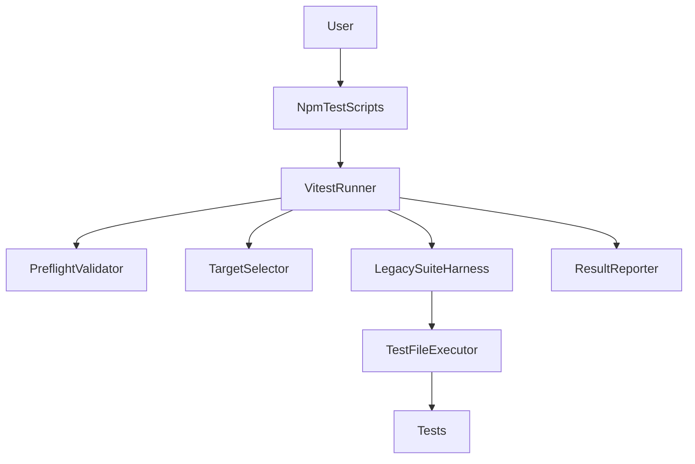
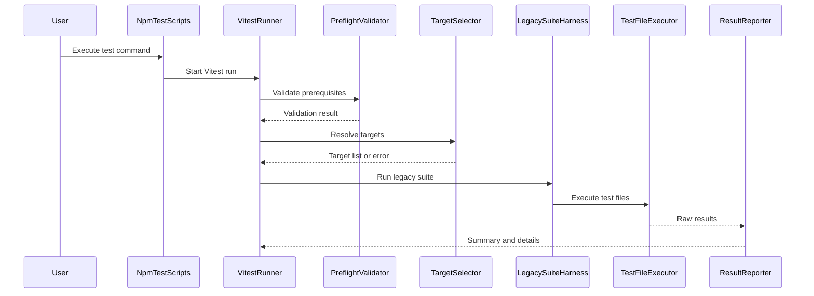

# Design Document

## Overview
本機能は、FootballContractSim のテスト実行を単一の入口に統一し、ローカル/CI それぞれの既定セットや対象指定を一貫した手順で実行できるようにする。開発者は用途に応じた実行モード、対象選択、出力形式を選べ、結果要約と失敗詳細を短時間で把握できる。設計の中心は Vitest による統一実行と、既存テストスクリプトを内包するレガシー実行ハーネスの提供である。

対象ユーザーは開発者と CI 実行環境であり、既存の Node.js 実行基盤とリポジトリ構成に適合する設計とする。既存のアプリ機能には影響を与えず、テスト実行の体験を改善することに集中する。

### Goals
- 単一のテスト実行入口を提供し、ローカル/CI の実行手順を統一する
- テスト対象の選択（領域・ファイル・複数指定）を明確化する
- 実行結果を短時間で把握できる要約と機械可読出力を提供する

### Non-Goals
- テストケース内容の変更や追加
- Vitest 以外の追加テストフレームワーク導入
- アプリ本体の機能要件への影響

## Requirements Traceability

| Requirement | Summary | Components | Interfaces | Flows |
|-------------|---------|------------|------------|-------|
| 1.1 | ローカル既定セットを実行 | NpmTestScripts, VitestRunner, LegacySuiteHarness | Service | Sequence A |
| 1.2 | CI既定セットを実行 | NpmTestScripts, VitestRunner, LegacySuiteHarness | Service | Sequence A |
| 1.3 | 未知モード提示 | NpmTestScripts | Service | Sequence A |
| 1.4 | 単一入口提供 | NpmTestScripts | Service | Sequence A |
| 2.1 | 領域指定実行 | TargetSelector | Service | Sequence A |
| 2.2 | ファイル指定実行 | TargetSelector | Service | Sequence A |
| 2.3 | 対象不存在時の提示 | TargetSelector | Service | Sequence A |
| 2.4 | 複数対象の統合実行 | TargetSelector | Service | Sequence A |
| 3.1 | まとめ結果出力 | VitestRunner | Service | Sequence A |
| 3.2 | 失敗詳細出力 | VitestRunner | Service | Sequence A |
| 3.3 | 進行状況表示 | VitestRunner | State | Sequence A |
| 3.4 | 機械可読出力 | VitestRunner | Service | Sequence A |
| 4.1 | 実行前検証 | PreflightValidator | Service | Sequence A |
| 4.2 | 前提不足時の中止と案内 | PreflightValidator | Service | Sequence A |
| 4.3 | ローカル/CIで同一検証 | PreflightValidator | Service | Sequence A |

## Architecture

### Existing Architecture Analysis (if applicable)
- 既存の実行入口は npm scripts に限定されており、テスト専用の統一入口は存在しない
- Node.js 実行環境は Dev Container 前提で整備済み
- `tests/` 配下に多数のテストが存在し、対象選択の要件が高い

### Architecture Pattern & Boundary Map
**Architecture Integration**:
- Selected pattern: Script Orchestrator with Vitest（単一入口とテスト実行基盤の統一）
- Domain/feature boundaries: npm scripts と Vitest 実行、レガシーハーネス、対象選択、事前検証の責務を分離
- Existing patterns preserved: npm scripts を入口として維持
- New components rationale: Vitest 実行基盤とレガシー実行ハーネスを追加し、対象選択と事前検証を分離
- Steering compliance: Node.js 実行基盤と App Router/BFF 構成に影響を与えない



### Technology Stack

| Layer | Choice / Version | Role in Feature | Notes |
|-------|------------------|-----------------|-------|
| Frontend / CLI | Vitest 2.1.6 | テスト実行の統一基盤 | 既存テストを内包 |
| Frontend / CLI | tsx 4.19.3 | TypeScript テスト実行補助 | レガシー実行用 |
| Frontend / CLI | Node.js (runtime) | テスト実行の入口と制御 | 既存環境を利用 |
| Backend / Services | None | 追加サービスなし | アプリ本体に影響なし |
| Data / Storage | None | 永続化なし | 実行時のみ使用 |
| Messaging / Events | None | 非同期メッセージングなし |  
| Infrastructure / Runtime | npm scripts | 実行入口の統一 | 既存運用に整合 |

## System Flows



## Components and Interfaces

| Component | Domain/Layer | Intent | Req Coverage | Key Dependencies (P0/P1) | Contracts |
|-----------|--------------|--------|--------------|--------------------------|-----------|
| NpmTestScripts | CLI | 実行入口の統一とモード制御 | 1.1, 1.2, 1.3, 1.4 | VitestRunner (P0) | Service |
| VitestRunner | CLI | テスト実行基盤と出力の統一 | 1.1, 1.2, 3.1, 3.2, 3.3, 3.4 | LegacySuiteHarness (P0), ResultReporter (P1) | Service, State |
| PreflightValidator | CLI | 実行前提の検証 | 4.1, 4.2, 4.3 | None | Service |
| TargetSelector | CLI | 領域/ファイル指定の解決 | 2.1, 2.2, 2.3, 2.4 | Tests (P1) | Service |
| LegacySuiteHarness | CLI | 既存テストの互換実行 | 1.1, 1.2 | TestFileExecutor (P0) | Service |
| TestFileExecutor | CLI | 1ファイル単位の実行委譲 | 1.1, 1.2 | Tests (P0) | Service |
| ResultReporter | CLI | 結果の要約と失敗詳細 | 3.1, 3.2 | None | Service |

### CLI

#### NpmTestScripts

| Field | Detail |
|------|--------|
| Intent | npm scripts を通じて実行入口を一本化する |
| Requirements | 1.1, 1.2, 1.3, 1.4 |

**Responsibilities & Constraints**
- 実行モードの選択肢を固定し、利用方法を明示する
- 実行入口を単一の npm scripts に集約する

**Dependencies**
- Inbound: User — テスト実行要求 (P0)
- Outbound: VitestRunner — 実行基盤 (P0)

**Contracts**: Service [x]

##### Service Interface
```typescript
type TestRunMode = "local" | "ci";

type OutputFormat = "human" | "json";

type TargetKind = "area" | "file";

interface TestTarget {
  kind: TargetKind;
  value: string;
}

interface TestRunRequest {
  mode: TestRunMode;
  targets: TestTarget[];
  output: OutputFormat;
}

type TestRunErrorType = "UnknownMode" | "MissingTarget" | "PreflightFailed";

interface TestRunError {
  type: TestRunErrorType;
  message: string;
  details?: string[];
}

interface TestRunSummary {
  total: number;
  passed: number;
  failed: number;
  skipped: number;
}

interface TestRunResult {
  summary: TestRunSummary;
  failures: string[];
}

interface TestExecutionService {
  run(request: TestRunRequest): Promise<TestRunResult | TestRunError>;
}
```
- Preconditions: `mode` は既知の値であること、`targets` は空でも許容されるが既定ルールに従うこと
- Postconditions: 成功時は要約と失敗詳細を含む
- Invariants: 失敗時は `TestRunError` の型に従う

**Implementation Notes**
- Integration: npm scripts による統一入口
- Validation: 未知モードの即時拒否
- Risks: 入口の分散防止

#### VitestRunner

| Field | Detail |
|------|--------|
| Intent | Vitest を実行基盤としてテストを統合実行する |
| Requirements | 1.1, 1.2, 3.1, 3.2, 3.3, 3.4 |

**Responsibilities & Constraints**
- テスト実行の進行状況と結果要約を統一する
- 機械可読出力をサポートする

**Dependencies**
- Inbound: NpmTestScripts — 実行要求 (P0)
- Outbound: LegacySuiteHarness — 既存テスト実行 (P0)
- Outbound: PreflightValidator — 実行前検証 (P0)
- Outbound: TargetSelector — 対象解決 (P1)
- Outbound: ResultReporter — 結果要約 (P1)

**Contracts**: Service [x] State [x]

##### Service Interface
```typescript
interface VitestRunOptions {
  mode: TestRunMode;
  targets: TestTarget[];
  output: OutputFormat;
}

interface VitestRunnerService {
  execute(options: VitestRunOptions): Promise<TestRunResult | TestRunError>;
}
```
- Preconditions: Vitest 実行環境が利用可能であること
- Postconditions: 成功時は要約と失敗詳細を返す
- Invariants: 出力形式に依存せず同じ情報を保持する

**Implementation Notes**
- Integration: Vitest 設定とレガシーハーネスを統合
- Validation: 実行前に PreflightValidator を必ず通す
- Risks: 既存テストの実行方式差異

#### PreflightValidator

| Field | Detail |
|------|--------|
| Intent | 実行前提の共通検証を行う |
| Requirements | 4.1, 4.2, 4.3 |

**Responsibilities & Constraints**
- ローカル/CI 共通の検証を定義する
- 失敗時は復旧手順を提示する

**Dependencies**
- Inbound: VitestRunner — 実行前検証要求 (P0)

**Contracts**: Service [x]

##### Service Interface
```typescript
interface PreflightCheckResult {
  ok: true;
} 

interface PreflightCheckError {
  ok: false;
  message: string;
  remedies: string[];
}

interface PreflightValidator {
  validate(): Promise<PreflightCheckResult | PreflightCheckError>;
}
```
- Preconditions: 実行環境が Node.js を利用可能であること
- Postconditions: `ok` が true の場合のみ続行可能
- Invariants: ローカル/CI で同じ検証項目を用いる

**Implementation Notes**
- Integration: VitestRunner の実行前に必ず呼び出す
- Validation: 事前に必要な依存やパスを確認
- Risks: 検証項目の過不足は要件レビューで調整

#### TargetSelector

| Field | Detail |
|------|--------|
| Intent | 対象指定を実行可能なリストに解決する |
| Requirements | 2.1, 2.2, 2.3 |

**Responsibilities & Constraints**
- 領域/ファイル指定を統一的に解釈する
- 対象が存在しない場合は候補提示を行う

**Dependencies**
- Inbound: VitestRunner — 対象解決要求 (P0)
- External: Tests — tests/ 配下のテスト集合 (P1)

**Contracts**: Service [x]

##### Service Interface
```typescript
interface TargetResolutionResult {
  targets: TestTarget[];
}

interface TargetResolutionError {
  message: string;
  candidates: string[];
}

interface TargetSelector {
  resolve(request: TestRunRequest): Promise<TargetResolutionResult | TargetResolutionError>;
}
```
- Preconditions: `request` の `targets` 形式が正しい
- Postconditions: 解決された対象はテスト実行で利用可能
- Invariants: 失敗時は候補を返す

**Implementation Notes**
- Integration: tests/ の構成に合わせた解決ルール
- Validation: 存在確認と候補生成
- Risks: 対象指定の表記揺れ

#### LegacySuiteHarness

| Field | Detail |
|------|--------|
| Intent | 既存テストスクリプトを Vitest 配下で実行する |
| Requirements | 1.1, 1.2 |

**Responsibilities & Constraints**
- 既存の `.test.js` / `.test.ts` を順次実行する
- 実行結果を Vitest に伝播する

**Dependencies**
- Inbound: VitestRunner — 実行依頼 (P0)
- Outbound: TestFileExecutor — ファイル実行 (P0)
- External: Tests — テスト実行対象 (P0)

**Contracts**: Service [x]

##### Service Interface
```typescript
interface LegacySuiteHarness {
  run(targets: TestTarget[]): Promise<TestRunResult | TestRunError>;
}
```
- Preconditions: 対象解決済みであること
- Postconditions: 失敗詳細と統計を返す
- Invariants: 実行順序は決定的であること

**Implementation Notes**
- Integration: 既存テストを Vitest に内包
- Validation: 対象の存在確認
- Risks: TypeScript 実行時の環境差異

#### TestFileExecutor

| Field | Detail |
|------|--------|
| Intent | 単一テストファイルを Node.js または tsx で実行する |
| Requirements | 1.1, 1.2 |

**Responsibilities & Constraints**
- `.test.js` は Node.js で実行する
- `.test.ts` は tsx で実行する

**Dependencies**
- Inbound: LegacySuiteHarness — ファイル実行要求 (P0)
- External: Node.js runtime — 実行環境 (P0)
- External: tsx — TypeScript 実行補助 (P1)

**Contracts**: Service [x]

##### Service Interface
```typescript
interface TestFileExecutionResult {
  status: number | null;
  stdout: string;
  stderr: string;
}

interface TestFileExecutor {
  run(filePath: string): Promise<TestFileExecutionResult>;
}
```
- Preconditions: `filePath` が存在し実行可能であること
- Postconditions: 標準出力/標準エラーを返す
- Invariants: 実行結果は再現可能であること

**Implementation Notes**
- Integration: Node.js/tsx での統一実行
- Validation: 実行コードの終了ステータスを評価
- Risks: 実行権限やパス差異

#### ResultReporter

| Field | Detail |
|------|--------|
| Intent | 結果要約と失敗詳細の提示 |
| Requirements | 3.1, 3.2 |

**Responsibilities & Constraints**
- 実行結果を開発者向けに整理する

**Dependencies**
- Inbound: TestRunnerAdapter — 実行結果 (P0)
- Outbound: ResultFormatter — 形式変換 (P1)

**Contracts**: Service [x]

##### Service Interface
```typescript
interface ResultReporter {
  report(result: TestRunResult, format: OutputFormat): Promise<TestRunResult>;
}
```
- Preconditions: RawTestResult が取得済みであること
- Postconditions: 要約と失敗詳細が提示される
- Invariants: 機械可読出力でも同じ情報が含まれる

**Implementation Notes**
- Integration: CLI の出力先に集約
- Validation: 失敗テストの識別子の一貫性
- Risks: 出力形式の追加時の互換性

#### ResultFormatter

| Field | Detail |
|------|--------|
| Intent | 人間向け/機械向けの形式変換 |
| Requirements | 3.4 |

**Responsibilities & Constraints**
- 出力形式の切り替え

**Dependencies**
- Inbound: ResultReporter — 出力要求 (P0)

**Contracts**: Service [x]

##### Service Interface
```typescript
interface FormattedOutput {
  contentType: "text" | "json";
  payload: string;
}

interface ResultFormatter {
  format(result: TestRunResult, format: OutputFormat): FormattedOutput;
}
```
- Preconditions: `format` が既知の値であること
- Postconditions: 指定形式の出力が生成される
- Invariants: JSON 形式は機械可読である

**Implementation Notes**
- Integration: 既定は人間向け出力
- Validation: JSON スキーマの安定性
- Risks: 形式拡張時の互換性

#### ProgressEmitter

| Field | Detail |
|------|--------|
| Intent | 実行中の進行状況を提示する |
| Requirements | 3.3 |

**Responsibilities & Constraints**
- 実行中に進行状況を通知する

**Dependencies**
- Inbound: TestRunnerAdapter — 実行状況 (P1)

**Contracts**: State [x]

**Implementation Notes**
- Integration: CLI 標準出力での簡易表示
- Validation: 進行状況の過剰表示を抑える
- Risks: 実行基盤によって進捗取得が制限される

## Data Models

### Domain Model
- テスト実行リクエストと結果要約を中心とした単純なドメイン
- 主要な値オブジェクト: `TestRunRequest`, `TestRunResult`, `TestRunPlan`

### Logical Data Model
- `TestRunRequest` はモード・対象・出力形式から成る
- `TestRunResult` は要約（pass/fail/skip）と失敗詳細を保持

### Data Contracts & Integration
- CLI からの入力は `TestRunRequest` へ正規化
- 機械可読出力は `TestRunResult` を JSON 化した形式を採用

## Error Handling

### Error Strategy
- 事前検証で失敗を早期に検出し、復旧手順を提示
- 対象解決の失敗は候補を返して再実行を促す

### Error Categories and Responses
- User Errors: 未知モード、対象不存在 → 利用方法と候補を提示
- System Errors: 実行基盤の失敗 → 実行停止と再試行ガイド
- Business Logic Errors: 前提不足 → 具体的な復旧手順を提示

### Monitoring
- 実行ログに開始/終了/失敗要因を記録し、CI のログ集約に対応

## Testing Strategy

- Unit Tests: 対象解決、実行計画、出力整形の検証
- Integration Tests: CLI 入口から実行計画・結果要約までの一連フロー
- E2E/UI Tests: 該当なし（CLI ベース）
- Performance/Load: 大量テスト対象時の実行時間の確認

## Optional Sections (include when relevant)

### Security Considerations
- 外部サービス連携は行わないため、追加の認証・認可は不要
- 実行結果の出力先はローカル/CI ログに限定する

### Performance & Scalability
- 対象指定によるテスト削減を優先し、無駄な実行を避ける

## Supporting References (Optional)
- `research.md` に調査の詳細と判断理由を記録
